# Escape do Saber

The purpose of our game is to provide a full experience by creating an environment where children can learn through play, making learning more fun. We also offer some additional features to make the game more inclusive, such as a color-blind mode and the possibility to play at different heights, allowing different perspectives of the same environment.

We aimed to create a full experience, not only visually but also through sound (background music and some sound effects). We also tried to give the player the possibility to grab as many objects as possible, as long as they made sense within the scene’s context.

To better understand the game mechanics, you can watch the gameplay video by clicking [here](https://www.youtube.com/watch?v=Vv4iP-dGJCA).

# Members

| Name                       | Student Number | Email                                           |
| -------------------------- | -------------- | ----------------------------------------------- |
| Daniel Cabral Bernardo     | 202108667      | [up202108667@up.pt](mailto:up202108667@up.pt)   |
| David Amorim Cordeiro      | 202108820      | [up202108820@up.pt](mailto:up202108820@up.pt)   |
| Ema Maria Monteiro Martins | 202402794      | [up202402794@up.pt](mailto:up202402794@up.pt)   |

# Setup and run

This game was programmed to be played using the Meta Quest 2. 

To install the game, you can find the APK file located within the Build folder.

# Controls

| Action | Input / Button |
| :--- | :--- |
| **Movement** (Forward, Backward, Left, Right) | Left Thumbstick (1) |
| **Rotation** | Right Thumbstick (1) |
| **Select Buttons / Move sliders** | Trigger (6) |
| **Grab Objects** | Grip Buttons (4) |
| **Pause Menu** | Menu Button (2) |

  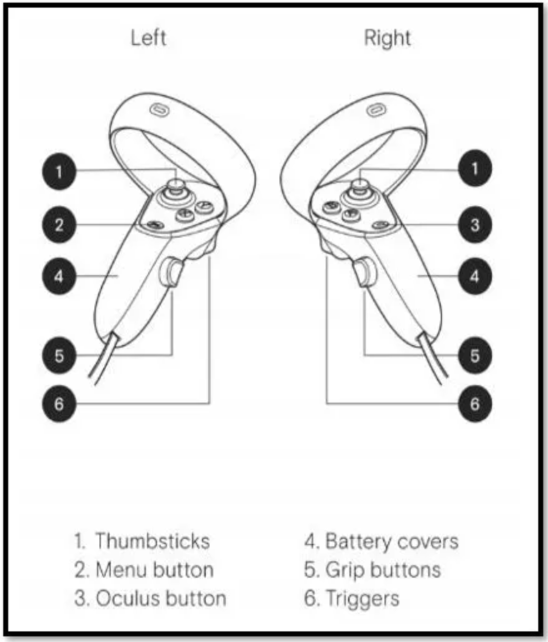

# Assets and Resources

All the assets used in this project were obtained from **Poly Pizza** and **Sketchfab**:

- [Poly Pizza](https://poly.pizza/)
- [Sketchfab](https://sketchfab.com/feed)

For the sound design, we tried to use copyright-free audio. The sounds were downloaded from the following sources: 

- [Background music](https://www.youtube.com/watch?v=GXYN8kATnVA&list=PLfP6i5T0-DkL0PYrS7c6oo1eYuKswXNNs&index=5)
- [Sound effect (picture color change on the walls)](https://www.youtube.com/watch?v=DdCjg1lX-Bc)

Related to the image of the controls, it is available [here](https://rolloverranch.com/resources).

For image generation, we also made use of generative AI tools, such as **Gemini**.

# Menus

**Main Menu**: This is the first menu that appears when the game starts. It allows the player to start the game, change some environment settings, adjust player conditions, or quit the game.

  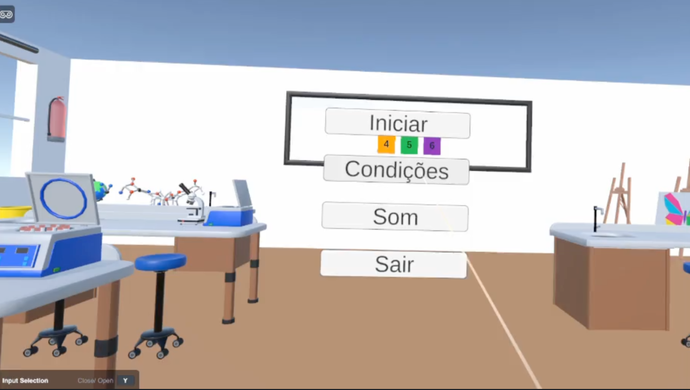

**Volume Menu**: This menu appears when the player selects the “Sound” option from the Main Menu. It allows the player to adjust the volume of the ambient sound and the sound effects. It also includes a button to return to the Main Menu.

  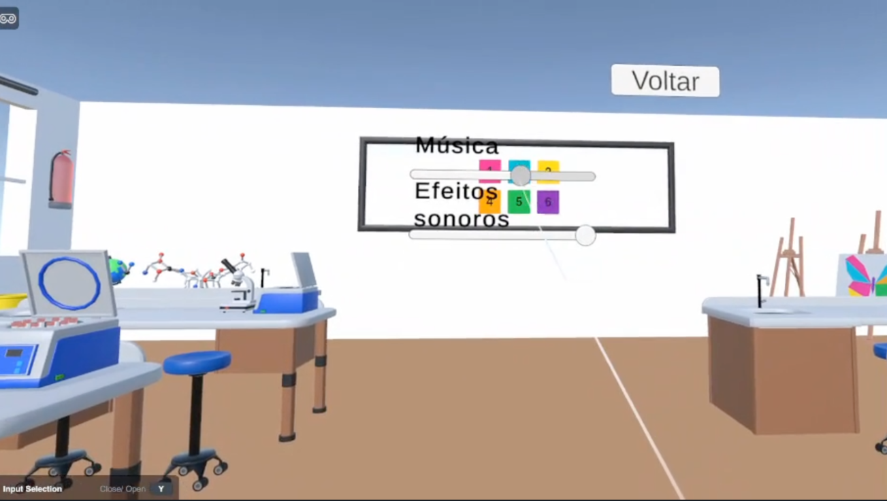

**Conditions Menu**: This menu appears when the “Conditions” button is selected from the Main Menu. It allows the player to change the player’s height and enable or disable color-blind mode. It also includes a button to return to the Main Menu.

  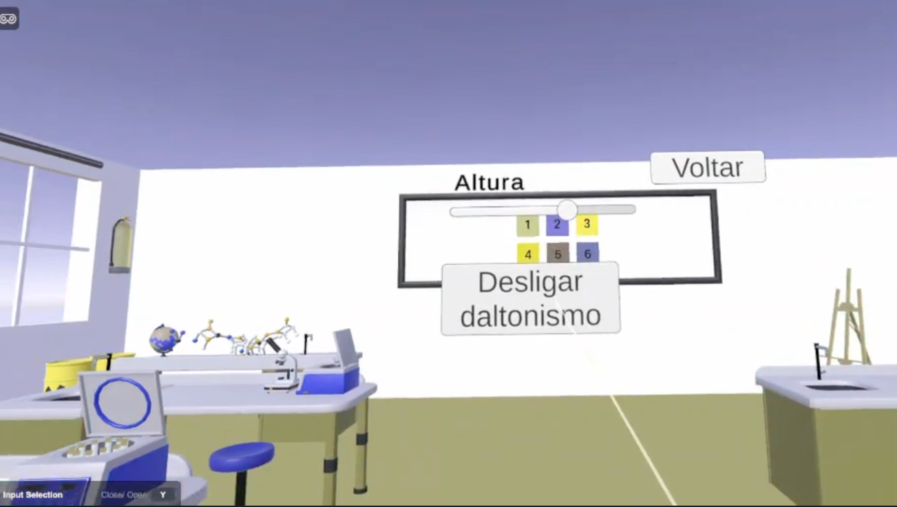

**Pause Menu**: This menu appears during gameplay. It allows you to change the same options as the Main Menu and has a button to return to the game.

  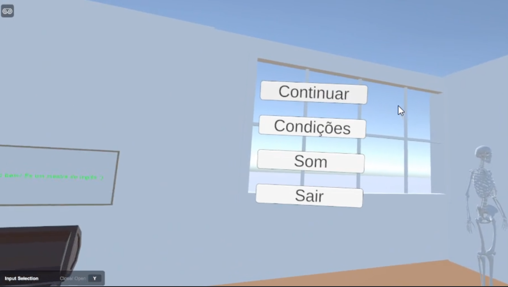

**Final Menu**: When the player finishes the game, this menu appears, giving the option to return to the Main Menu. It also congratulates the player to let them know they have won the game.

  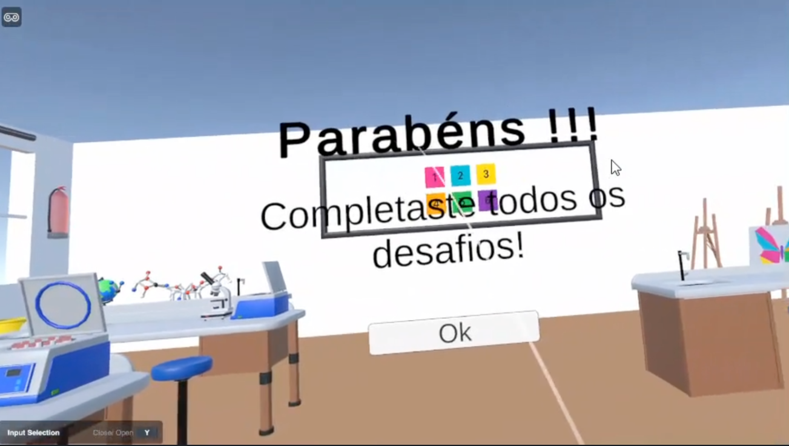

# Mini Games

To win the game, the player must complete three challenges, each one related to a different subject. We implemented one game for Arts, one for Science, and one for English.

**Painting Game**: The player must paint a butterfly using the correct colors. To do this, the player needs to search for clues that indicate the correct way to paint the butterfly. Some of the required colors are not provided directly, so the player must experiment by mixing colors to obtain secondary colors from the primary ones.

  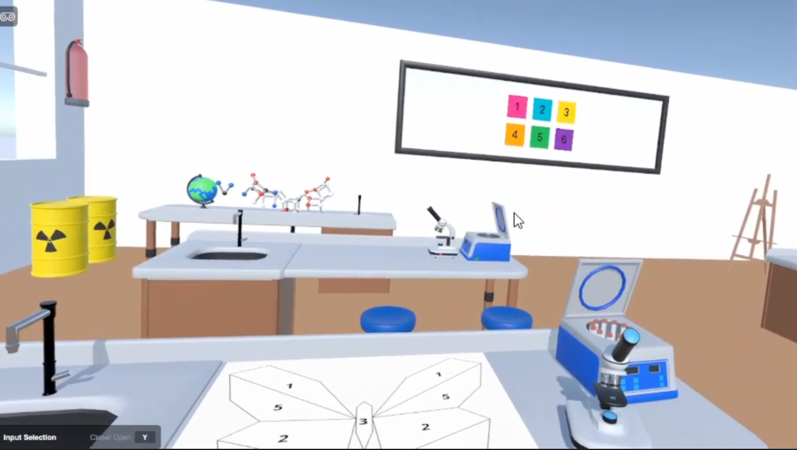
  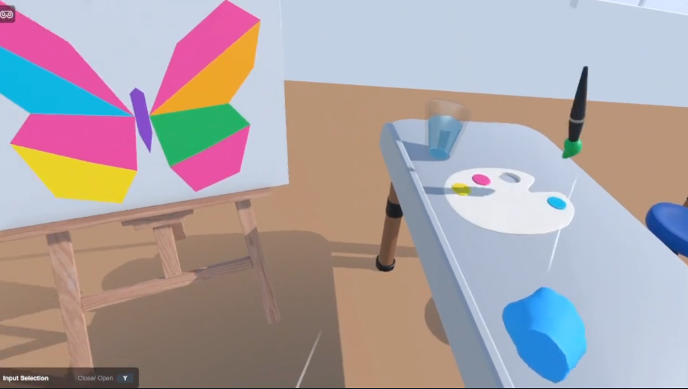

**Science Game**: The objective is to find all the bones of an incomplete skeleton scattered around the room and place them in their correct positions. To support learning, subtitles with the names of the bones are displayed when they are picked up.

  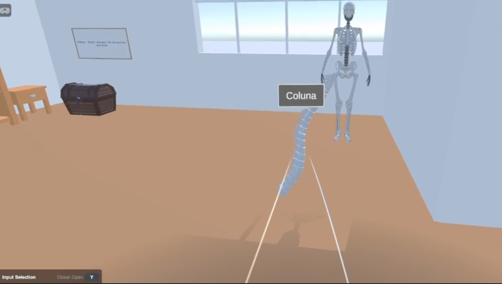
  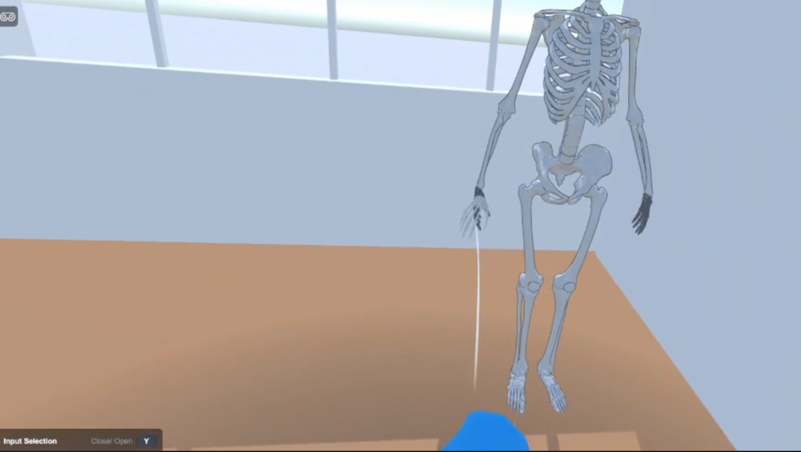

**English Game**: In this game, several words are placed on a board on the wall. The objective is for the student to learn English prepositions by placing objects according to the sentence shown, in order to complete each level.

  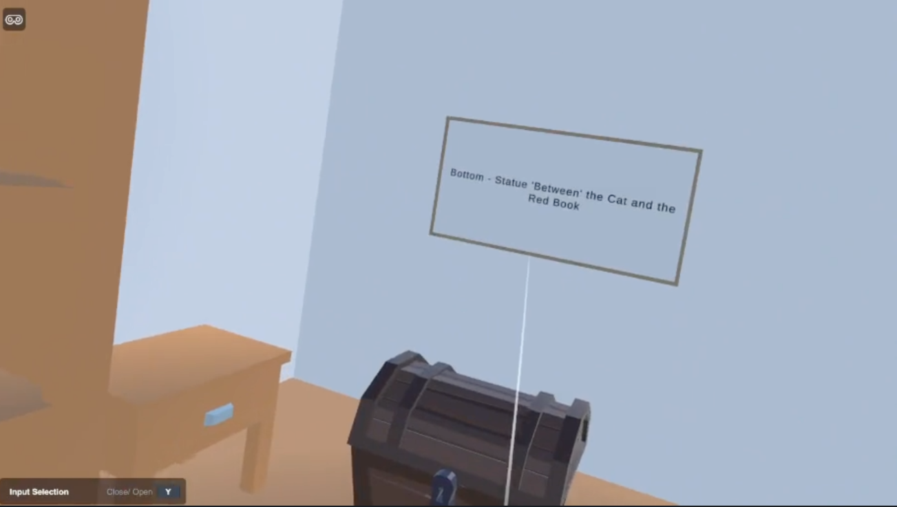
  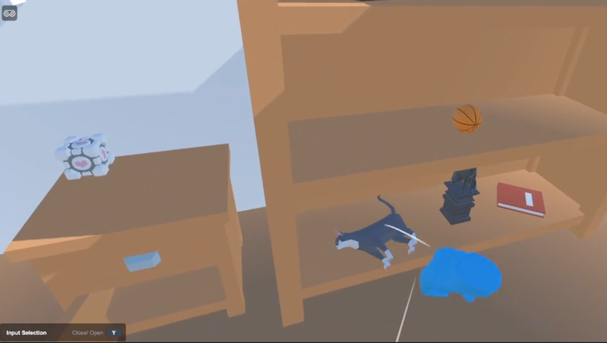

To provide clues about what needs to be done, there is a wall with four pictures: three related to the mini games and one related to the final objective, all initially displayed in grayscale. Each time the player completes a mini game, a sound comes from the wall, giving the impression that something has changed. The picture related to the completed mini game then changes from grayscale to full color.

  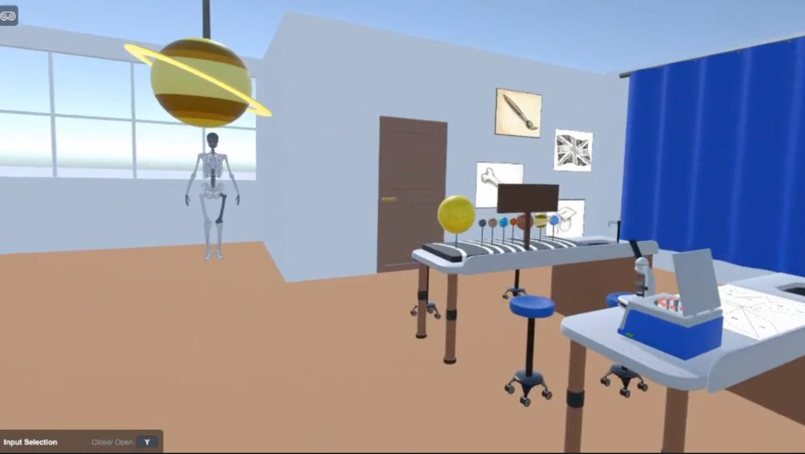

It is important to note that, although we are explaining our work here, during gameplay the idea is not to explicitly tell the student what to do. The student must explore the classroom to find clues about how to progress. The game is designed to function like an escape room, but with educational activities.

# Final Objective

When the student completes all three mini games, a door opens, giving access to a new room. In this room, there is a graduation cap that the student must pick up to finish the game.

As mentioned before, to help identify the final objective, there is a picture on the wall near the ones related to the mini games, showing a graduation cap. When the game is completed, a sound comes from the wall, the graduation cap picture changes from grayscale to full color, and the final menu appears.

  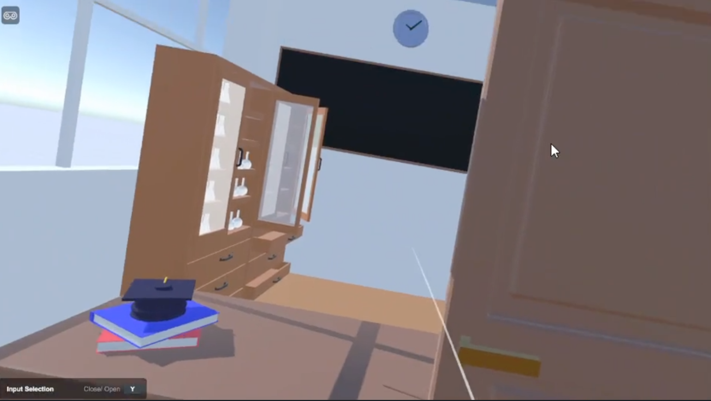

# Future work

In the future, we propose to add more mini-games, related to other subjects, to the game to enhance the experience.

We also wanted to enhance the player’s experience by adding more sound effects.

We intended for the settings to be maintained when the game restarts after completion. However, we encountered some issues implementing the height adjustment, which remains a small, unsolved bug.

Finally, as mentioned, we implemented a color-blind mode. However, the current colors do not accurately match a specific condition. In the future, we aim to implement an experience that is more realistic.