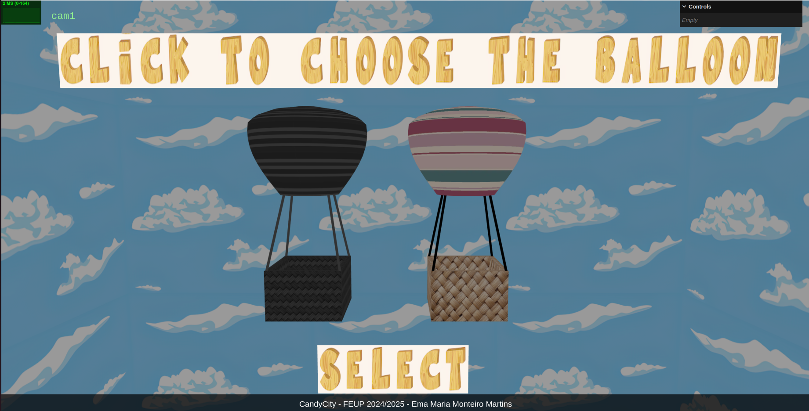
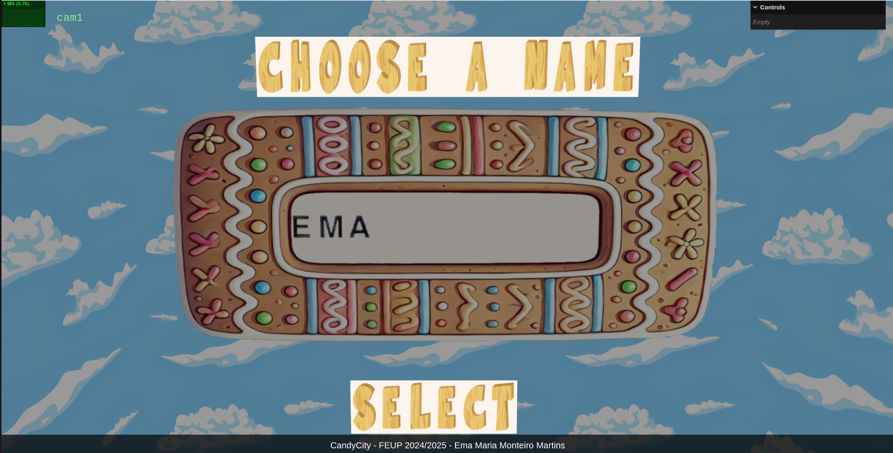
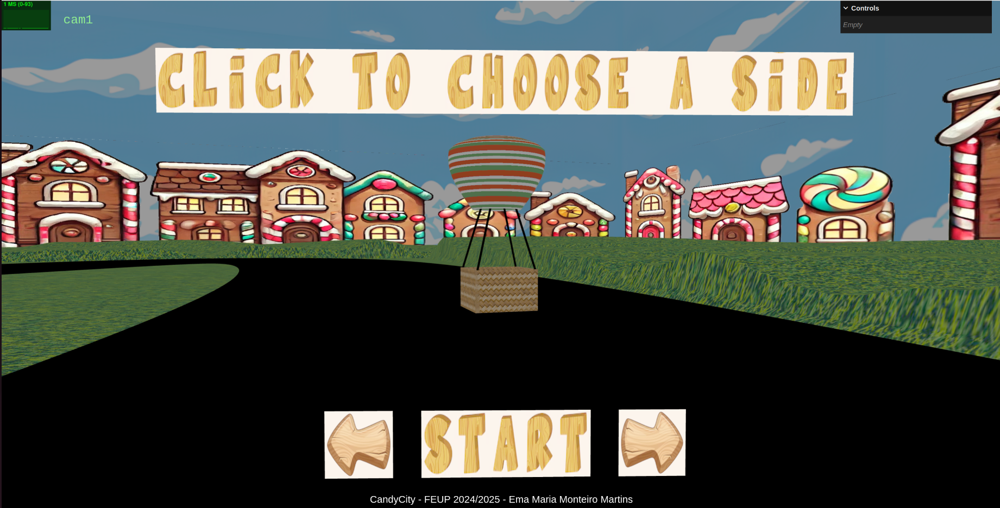
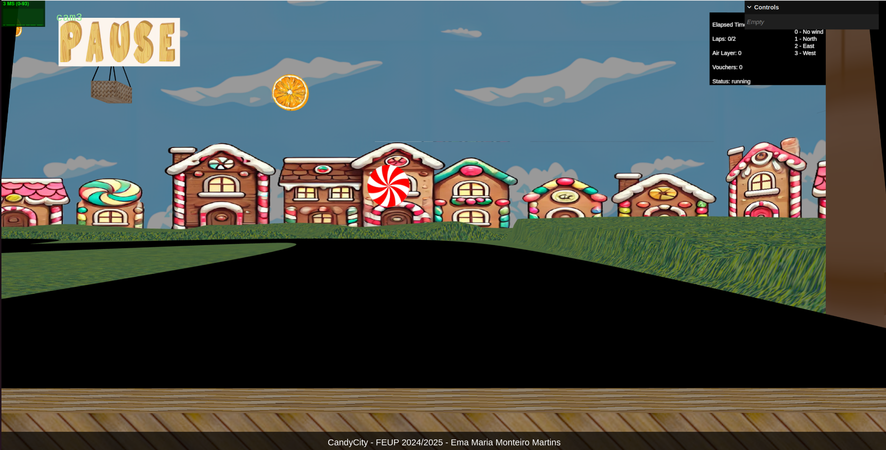
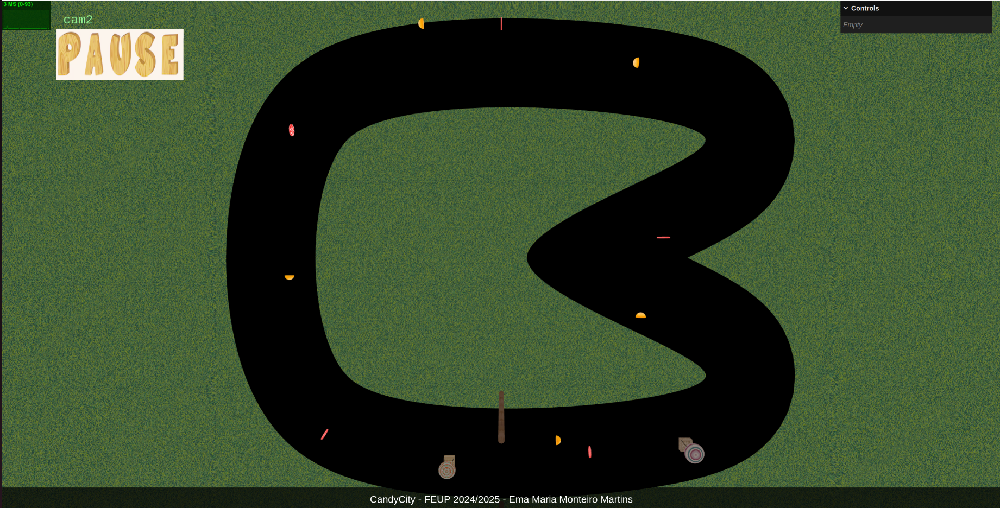
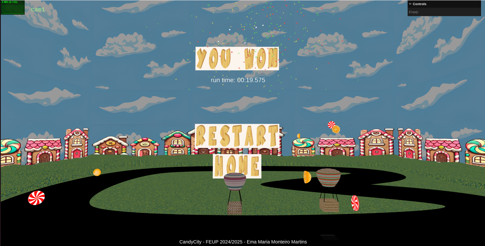

# Hot Air Balloon Races - Ema Martins

## Project Information

The main point of this project is to create a hot air balloon race. In the game, we can choose from 2 balloons. Then, the user can insert the player's name and choose the side they want to start the game. The player competes against the computer.

In *CityOfCandies*, we have power-ups (candies) and obstacles (oranges). The candies give you a voucher that can be used later to avoid penalties. Penalties occur when you collide with an obstacle, go off the road, or collide with the opponent's balloon. In those cases, if the player doesn't have vouchers, they need to wait 3 seconds before returning to play.

The player only controls the balloon's up and down movement using the W and S keys. The rest of the balloon's movements are determined by the different wind levels:
    - **Layer 4**: (highest layer) wind moves to the West
    - **Layer 3**: wind moves to the East
    - **Layer 2**: wind moves to the South
    - **Layer 1**: wind moves to the North
    - **Layer 0**: (lowest layer) there is no wind

## Organization/Code

The program was organized into 5 menus to make it easy to navigate between them. The main concept is that objects toggle between visible and non-visible states. This approach avoids reloading objects multiple times, reducing processing time and increasing performance. The main events are retrieved by a **picking** function, which identifies the object that was selected based on the order in which the objects appear, choosing the nearest visible one.

**Menu 1:** In this menu, the player chooses the balloon they want to play with. When a balloon is selected, a "selected" button appears, and the other balloons **change their texture to grayscale**. This second texture is obtained using the Canvas textures available in Three.js.

**Menu 2:** In this menu, the player uses the keyboard to input a name. The letters appear based on a function that maps the coordinates of a letter texture using **spritesheets**. This function maps letters based on their ASCII values. Other techniques were also implemented to display letters, such as manually mapping them to texture coordinates using a dictionary, HTML elements and using Canvas textures from Three.js.

This is also the first menu where the road appears. The **road was created using a Catmull-Rom spline as a guide** to build triangles of a specific size. The grass also makes its first appearance in this menu. It was created using **height mapping**.

**Menu 3:** In this menu, the player chooses the side they want to start the game on. The opponent automatically starts on the other side.

**Menu 4:** This menu is the actual gameplay. To ensure smooth balloon transitions, **KeyFrameAnimation** was used. The autonomous balloon follows predefined points.
To track the game state (balloon level, number of laps, runtime, number of vouchers), an **outdoor** display fixed to the camera is used. During the game, pressing the "Q" key switches between 3 camera views:
1. A third-person view from behind the balloon.

2. An overhead view.

3. A first-person view as if inside the balloon.

Obstacles and **power-ups change in size** using **shaders**, and houses around the scene **also use shaders** to **simulate depth**. To detect collisions with power-ups and obstacles, **AABB boxes** were used. To detect if the balloon is off the road, a **raycaster** was employed. This technique projects a ray from the balloon's center to check if it intersects with the road. The visualization of the balloon's position is supported by a projection on the road.

**Menu 5:** This menu appears when the game ends. If the player wins, fireworks are displayed using the **particle system** technique. The player can choose to replay the game with the same configuration (restart) or return to the home menu to change options.

The *MyTrack* and *MyBalloon* files don't exist because the objects were loaded using the YASF file format.

## Files and directories Overview

- **`index.html file`**: The main HTML file that serves as the entry point for the application. It includes scripts, styles, and the basic structure for rendering the 3D scene.

- **`style.css file`**: The css used to style the web page.

- **`main.js file`**: The file with the configuration of the program to initialize it.

- **`app.js file`**: This file creates instances of the different parts of the program and connect them.

- **`MyGuiInterface.js file`**: This file is responsible for the interaction between the user and the program.

- **`MyContents.js file`**: Is the file that creates all the scene and updates it.

- **`MyAxis.js file`**: Create the axis (per default, it isn't activated)

- **`loaders directory`**: This directory contains files to load the different components of the scene, since the cameras until the nodes.
  - **`loadCameras.js file`**: Has functions to load the cameras.
  - **`loadGlobals.js file`**: Has functions to load the globals of the scene, e.g, configure the background color, the ambient light, the skybox and the fog.
  - **`loadMaterials.js file`**: Has functions to load the materials.
  - **`loadNodes.js file`**: Has functions to load all the nodes.
  - **`loadPrimitives.js file`**: Has functions to load all the primitives and lights, e.g. load objects from different types: box, cylinder, nurb, rectangle, triangle, sphere and polygon. It also loads the different types of lights: directionalLight, pointLight and spotLight. It also loads lathe geometries, letters, and the road.

- **`files directory`**: Contain files to build some of the objects of the game.
  - **`MyFireworks.js file`**: Creates instances of fireworks and update them.
  - **`MyObstacles.js file`**: Creates instances of obstacles and have functions to manipulate them.
  - **`MyPowerUp.js file`**: Creates instances of powerUps and have functions to manipulate them.
  - **`MyOutdoorDisplay.js file`**: Creates instances of outdoors to display the information of the game and have functions to manipulate them.
  - **`MyRoute.js file`**: Contains the trajectory of the autonomous ballon.

- **`parser directory`**: This directory has the files that compose the parser of the json with the scene.
  - **`MyFileReader.js file`**: Reads the components written in YASF and tries to do a match with the object (for instance, if is one pointLight).
  - **`MySceneData.js file`**: Creates the objects based on the structure provided by the MyFileReader.js to be read in MyContents and then create the scene.

- **`scenes directory`**: This directory is where we keep the scenes.
  - **`textures directory`**: Directory with all the textures used by the scenes.
  - **`scene.json`**: Json file, written in YASF, that contains the objects of the scene.

- **`README.md file`**: This file contains an overview of the whole project

- **`images directory`**: Contains the images used in README.md file.

## Issues/Problems

- Make the transitions between air levels smoother.
- Enhance the scene by adding more objects around the road.
- Add more options for balloons and roads.
- The program has an issue where, if you click while the time is blocked, the movements are queued and executed once the block is lifted. This problem could be solved using a flag, but due to time constraints, it was not implemented.
- The initial idea was to use fixed cameras, which is why the board follows the camera during the game. Although the board's position relative to the camera was not corrected, I believe having movable cameras was a better choice, as it significantly enhances the gameplay experience.

