# Races

| Name                       | Student Number | Email                                           |
| -------------------------- | -------------- | ----------------------------------------------- |
|  Daniel Cabral Bernardo    | 202108667      | [up202108667@up.pt](mailto:up202108667@up.pt)   |
| David Amorim Cordeiro      | 202108820      | [up202108820@up.pt](mailto:up202108820@up.pt)   |
| Ema Maria Monteiro Martins | 202402794      | [up202402794@up.pt](mailto:up202402794@up.pt)   |

# Overview of the game

The main objective of the game is to race against a bot, with each bot offering a **different difficulty level**. There are three levels: easy, medium, and hard. The **higher the difficulty selected, the greater the bot’s chances of successfully overcoming obstacles**.

The player have the possibility to **choose between two different cars**, the red car or the white car.

The game has a **strategic phase** where the **player can place targets that can act as power-ups or obstacles**, **depending on the direction they are placed on the track and on which side of the track they are positioned**. The player also needs to take into consideration the **obstacles previously placed by the bot**, which are positioned **differently each time** the game is played.

The game is composed by the following 6 scenes:

- StartMenu
- ChooseDifficulty
- SelectCar
- TrackPlanning
- Race
- FinalMenu

# InitialMenu

When the game starts, it displays a button, the Start button. If the player selects Start button, the game proceeds to the next scene, the DifficultyMenu.

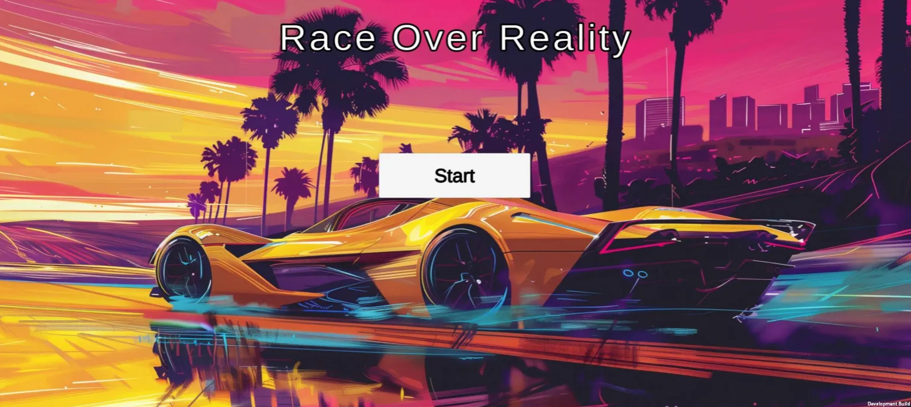

# DifficultyMenu

This scene shows to the user the 3 options of levels: Easy, Medium, Hard. After the player selects one of the difficulties, the level of the difficulty of the game is settle and the game follows for the next scene, the SelectCar scene.

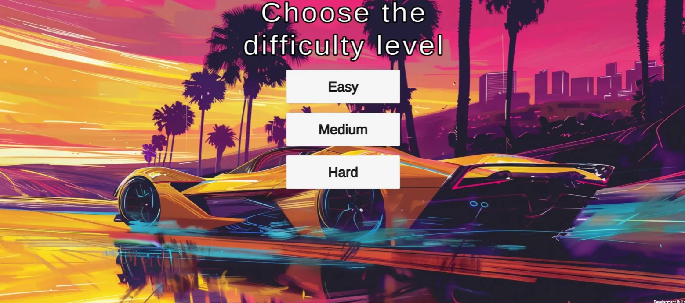

# SelectCar

At this stage, the smartphone camera activates, allowing the player to **choose their car**. There are two options available: **a red car and a white car**. The player must point the camera at the correct **target marker** so the game can recognize it.

Once the target is successfully detected, a confirmation message appears, asking whether the player is sure about their chosen car. By selecting Confirm, the player proceeds to the next scene, the TrackPlanning.

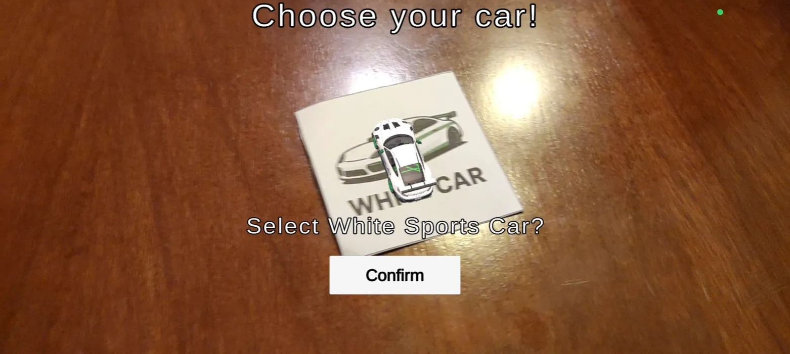

# TrackPlanning

During this phase, the player must first aim at the **track marker to reveal it**. After that, they can place **obstacles or power-ups** strategically by **positioning their markers near the track target**. The game displays the objects in real time while the player moves them.

Once the player is satisfied with the position, they simply click in "Place" to confirm the placement. **Up to three obstacles or power-ups** can be placed — with a maximum of one tire pile and two arrows. When the planning phase is complete, clicking "Save & Race" will take the player to the racing scene.

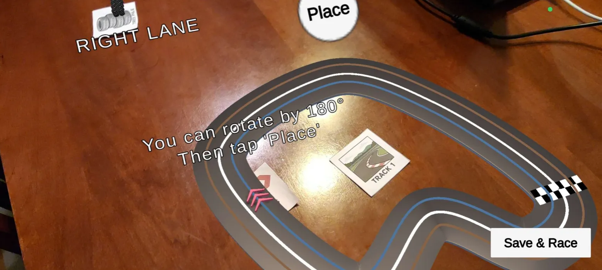

# Race

The cars follow a predefined path. To win the race, the player must avoid obstacles while strategically using power-ups.

### Avoiding Tire Stacks

To avoid tire stacks, the player must **jump** by quickly **moving the phone up and down**. If the jump is performed at the correct time, the car will successfully avoid the obstacle.

### Using the Shortcut Path

To take the shortcut, the player must **tilt the phone to the right** just before reaching the shortcut entrance. If done with the right timing, the car will follow a faster path, gaining advantage over the bot.

### Arrows (Power-ups or Hazards)

Red arrows may help or harm the racer depending on the direction they are crossed from. Crossing them from the **boost side increases the car’s speed** while crossing them from the **opposite side reduces the car’s speed**.

When the race finishes, the game move you for the FinalMenu.

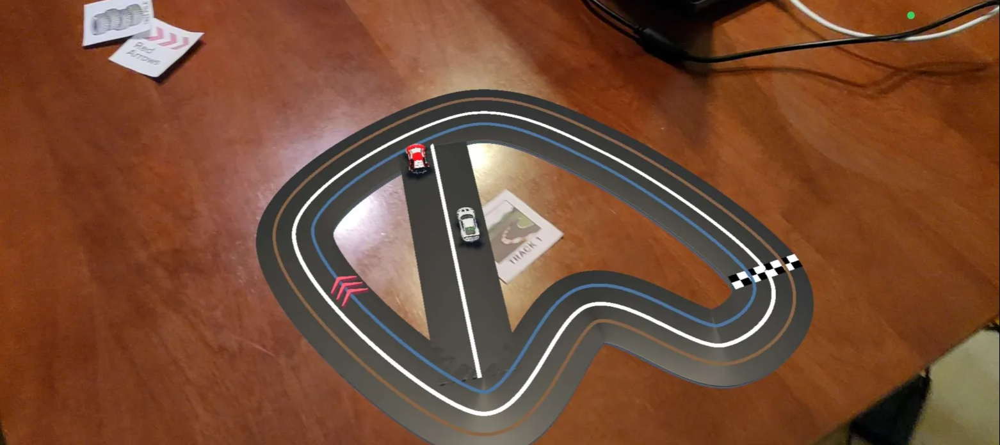

# FinalMenu

The finalMenu show you the result of the race, e.g, says if you won our lost the Race. It also show the player two button, one to quit the game, the "Quit", and other to return to the first menu, the "Main Menu".

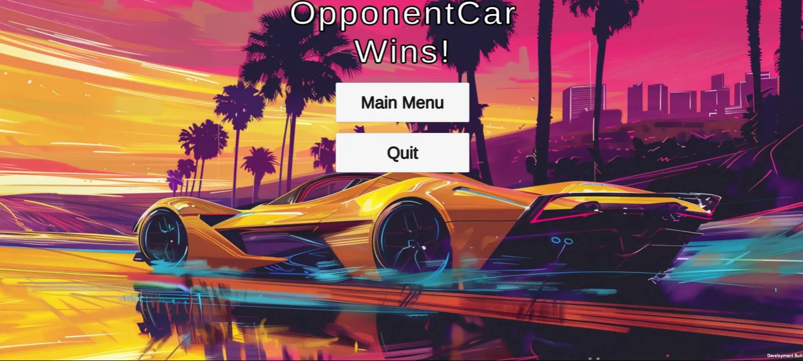

# Assets

The assets used to produce the game were mainly taken from **Sketchfab**.

For the Augmented Reality part, **Vuforia** was the platform used to detect and track the image targets that anchor the virtual objects in the real world.

The targets were generated with chatGPT. There were generated **5 targets**.

All the **targets** necessary to play the game are in the **./Races/Assests/Images.**

### Targets

| Name | Target Image | Definition |
|------|--------------|------------|
| Track Marker | 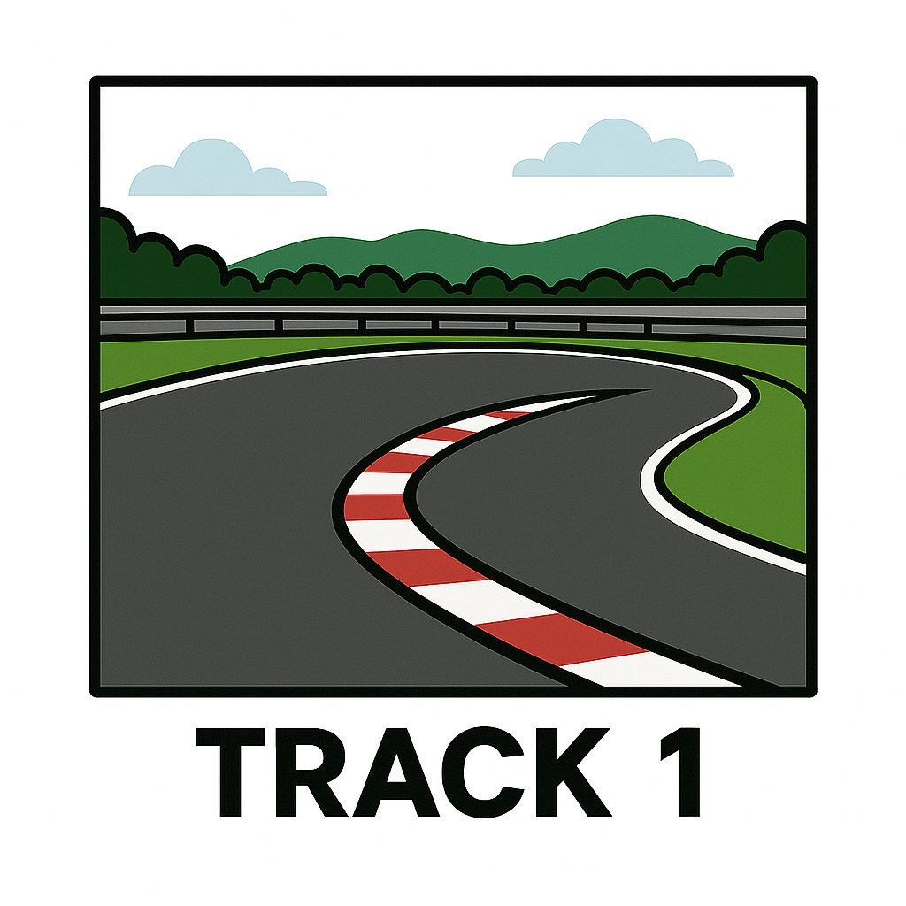 | Used to detect and anchor the race track in the real world. |
| Red Arrows | 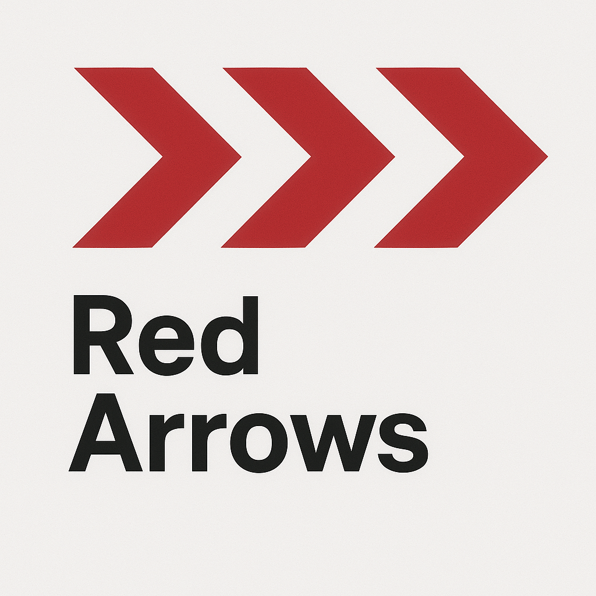 | Depending on orientation, they can boost or slow the player. |
| Tire Stack | 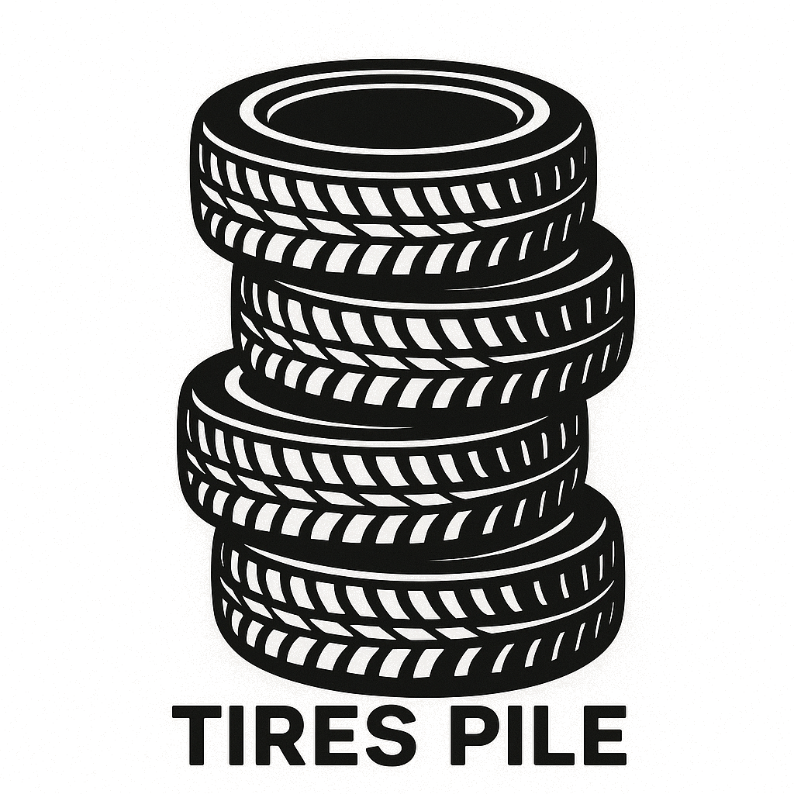 | Obstacle that forces the player to jump to avoid slowing down. |
| Red Car Marker | 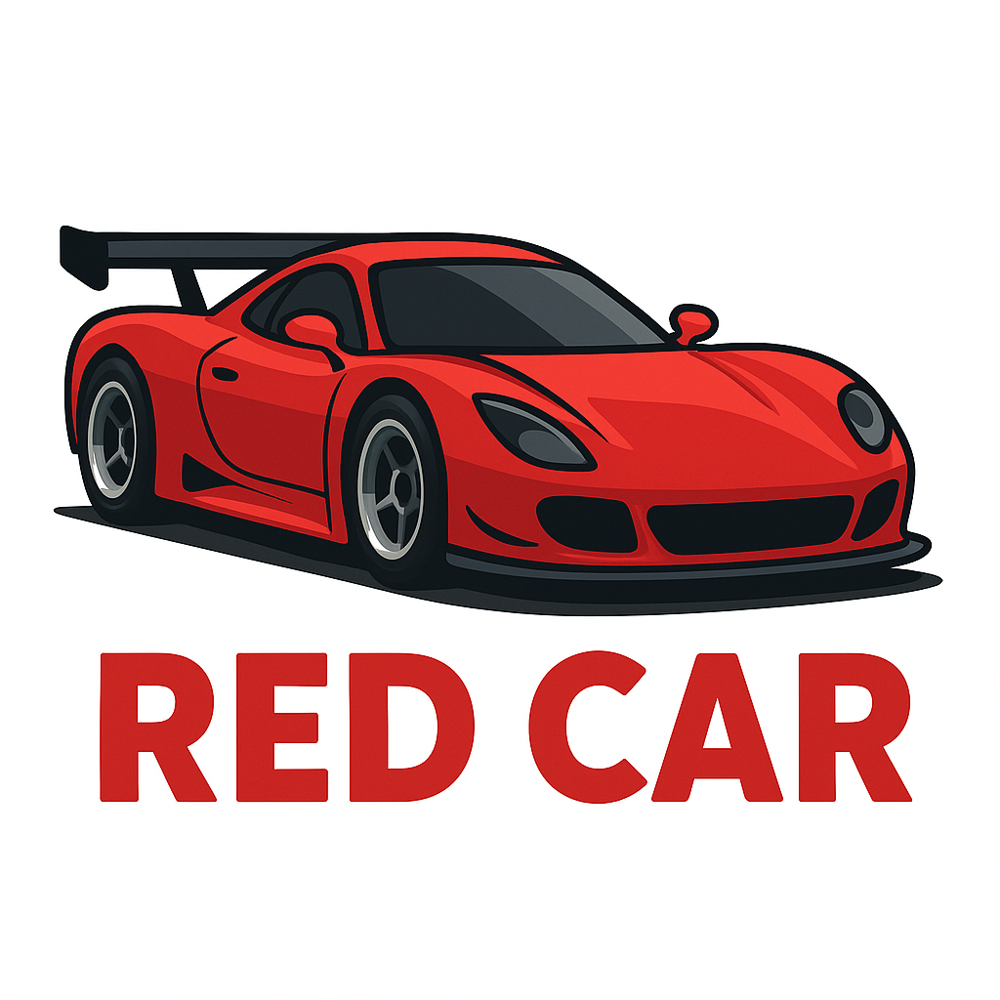 | AR marker used to select the red car in the SelectCar scene. |
| White Car Marker | 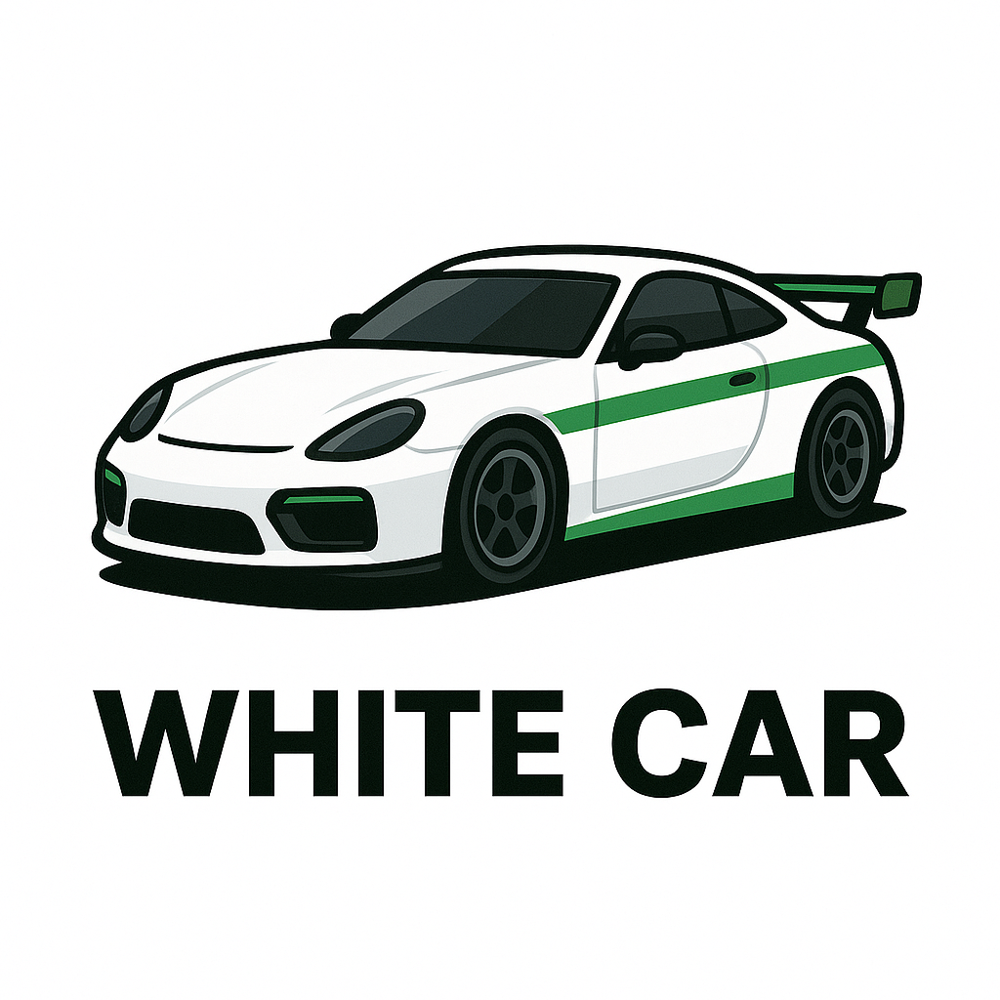 | AR marker used to select the white car in the SelectCar scene. |

# How to install

The APK is available in the root folder. To play the game, simply copy it to your mobile phone and install the app.
