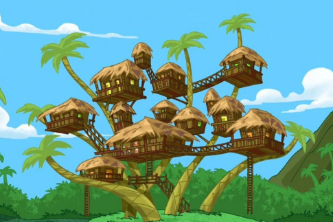
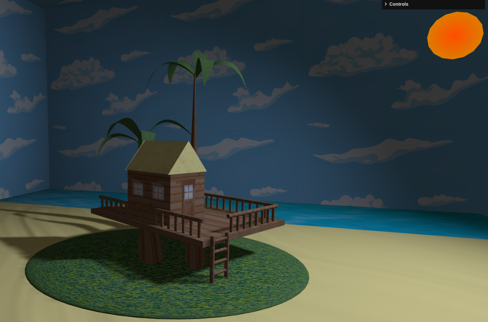
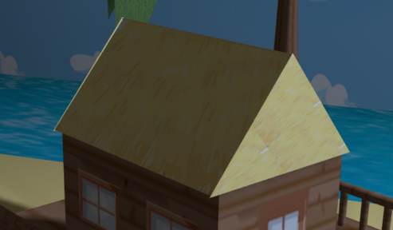
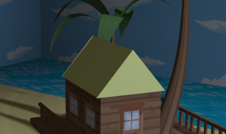
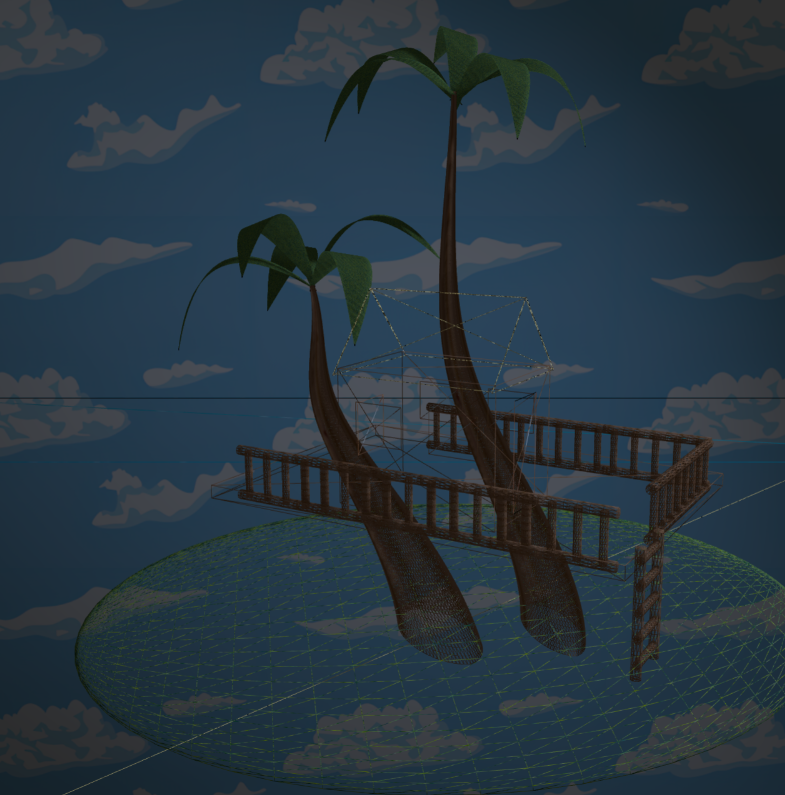
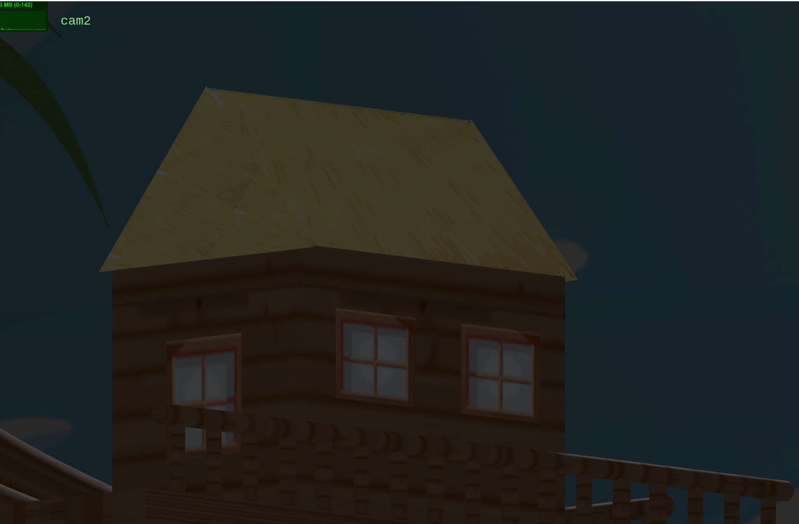
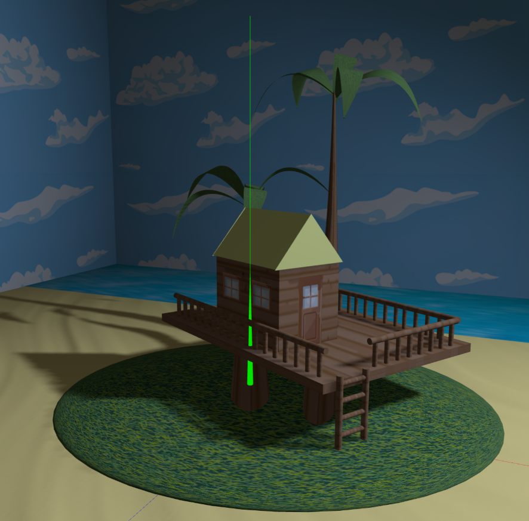

# Scene Generation - Ema Martins

## Project Information

The main point of this project was creating a scene based on a json file that was written in the YASF language.

With the information provided, we needed to:

- Create the scene with the elements provided by the json and guarantee the hierarchy of their properties (e.g, if the father has translations, pass them to the children or if some node has shadows, all the children will have shadows too, and they can't change this property anymore).
- Implement advanced textures : sky box, mip-maps, bump-textures, video-textures.
- Give the user the possibility to change the mode of wireframe between true and false, by using events provided by the interface.
- Create objects with the Buffer Geometry, which implies, for instance, calculating normals for the object.
- Implement different levels of detail, based on the distance between the object and the camera.

## Scene

The inspiration was based on one episode of the cartoon Phineas & Ferb when they arrived on a island after a shipwreck.

The built scene only contains part of the scene because it requires more than what was possible to build in the time of this project. The result scene is below:

The scene is composed by 2 trees where the stem and the leafs were made by nurbs. The house is composed by planes and triangles. The fences and ladder are made with cylinders. The base of the house is a rectangle and the sun is a polygon. The bush is an incomplete sphere and the water and the sand are planes.
In the scene, we have some lights, such as an ambientLight, a pointLight, a directionalLight and a spotLight.

All the objects have automatic mip-maps and the door has also manual mip-maps. The sand is simulated using a bump texture and the water is simulated using a video texture. The roof has different levels of detail, based on the distance to the camera.

The scene has 2 cameras, one perspective and other orthografic.

In the interface, the user can toggle on/off the wireframe from the materials, change between cameras, enable/disable the axis and enable/disable the lights present in the scene.

## Files and directories Overview

- **`index.html file`**: The main HTML file that serves as the entry point for the application. It includes scripts, styles, and the basic structure for rendering the 3D scene.

- **`style.css file`**: The css used to style the web page.

- **`main.js file`**: The file with the configuration of the program to initialize it.

- **`app.js file`**: This file creates instances of the different parts of the program and connect them.

- **`MyGuiInterface.js file`**: This file is responsible for the interaction between the user and the program.

- **`MyContents.js file`**: Is the file that creates all the scene and updates it.

- **`MyAxis.js file`**: Create the axis (per default, it isn't activated)

- **`loaders directory`**: This directory contains files to load the different components of the scene, since the cameras until the nodes.
  - **`loadCameras.js file`**: Has functions to load the cameras.
  - **`loadGlobals.js file`**: Has functions to load the globals of the scene, e.g, configure the background color, the ambient light, the skybox and the fog.
  - **`loadMaterials.js file`**: Has functions to load the materials.
  - **`loadNodes.js file`**: Has functions to load all the nodes.
  - **`loadPrimitives.js file`**: Has functions to load all the primitives and lights, e.g. load objects from different types: box, cylinder, nurb, rectangle, triangle, sphere and polygon. It also loads the different types of lights: directionalLight, pointLight and spotLight.

- **`parser directory`**: This directory has the files that compose the parser of the json with the scene.
  - **`MyFileReader.js file`**: Reads the components written in YASF and tries to do a match with the object (for instance, if is one pointLight).
  - **`MySceneData.js file`**: Creates the objects based on the structure provided by the MyFileReader.js to be read in MyContents and then create the scene.

- **`scenes directory`**: This directory is where we keep the scenes.
  - **`textures directory`**: Directory with all the textures used by the scenes.
  - **`scene.json`**: Json file, written in YASF, that contains the objects of the scene.

- **`README.md file`**: This file contains an overview of the whole project

- **`images directory`**: Contains the images used in README.md file.

## Levels of detail

Depending on the distance of the camera, the roof is build with a material with a texture or only a color.

## Wireframe

In the interface we can enable and disable the wireframe mode. In a wireframe mode, all objects are represented with the material with the propriety wireframe set to true. In that case, the scene is represented like below:

## Cameras

In the scene we set two cameras, one perspective and other orthografic.
The perspective camera shows the following scene:

The orthografic camera shows this scene:

## Axis

It's possible to enable and disable the axis too, as shown in the following image.

## Issues/Problems

- The structure that I used was difficult in terms of performance because, when the camera moves, we need to rebuild the scene to verify if the other level of detail was chosen. The same was made for the wireframe. I consider that the performance can be improved, but because of the time, it was impossible to change the base code after it had a big part done based on it.

- The automatic mip-maps are well implemented but the manual mip-map has a problem related to the distance to process the mip-map.
