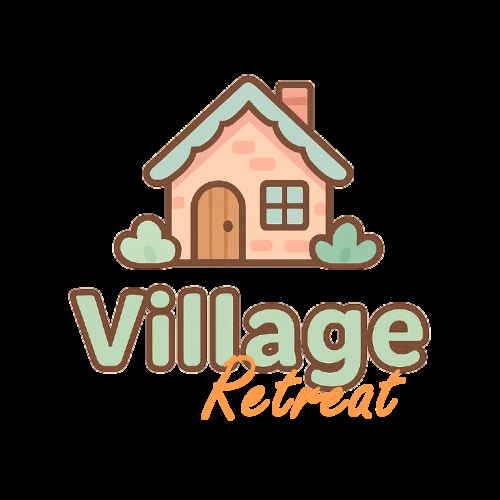
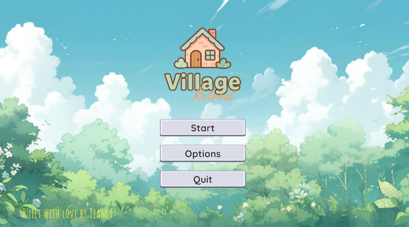
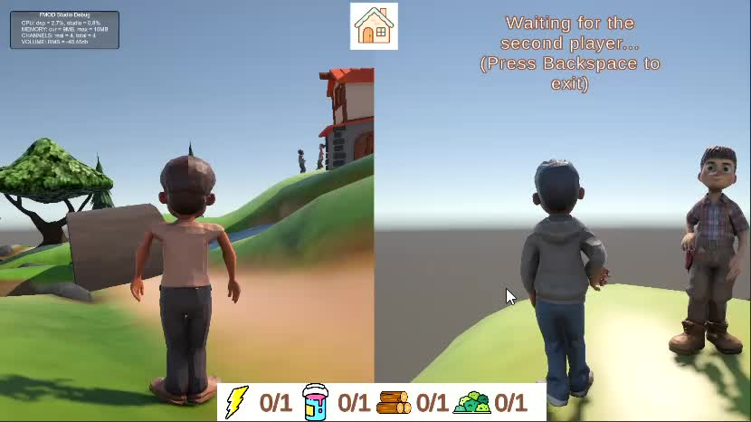
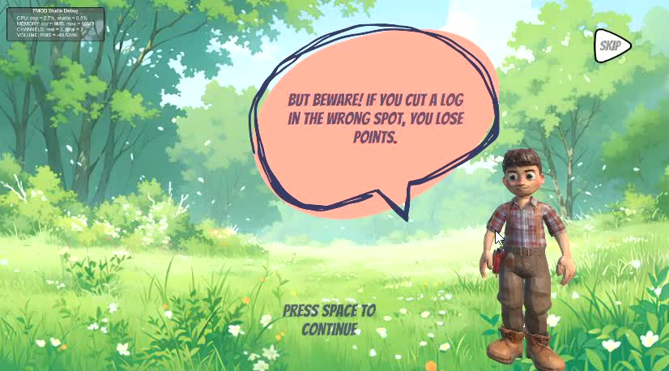
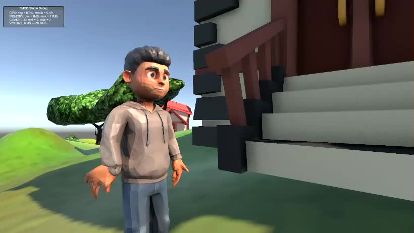
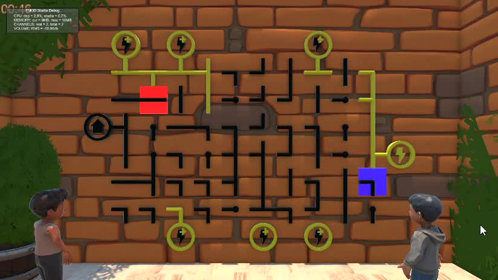
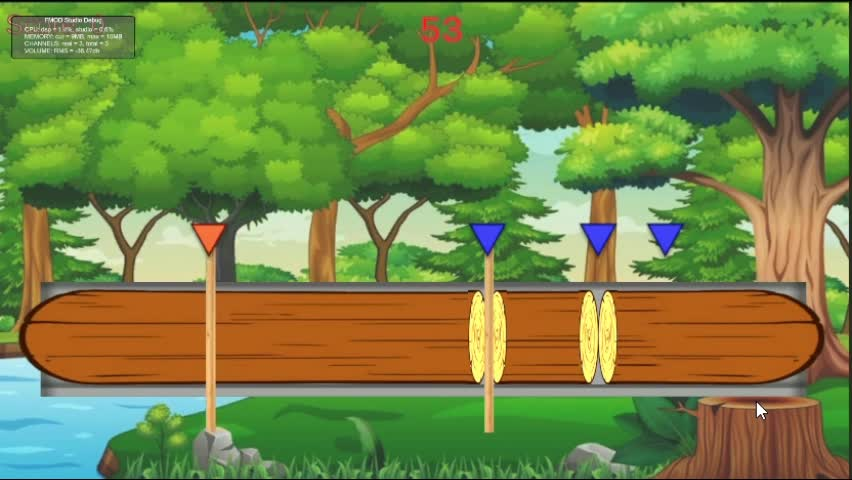
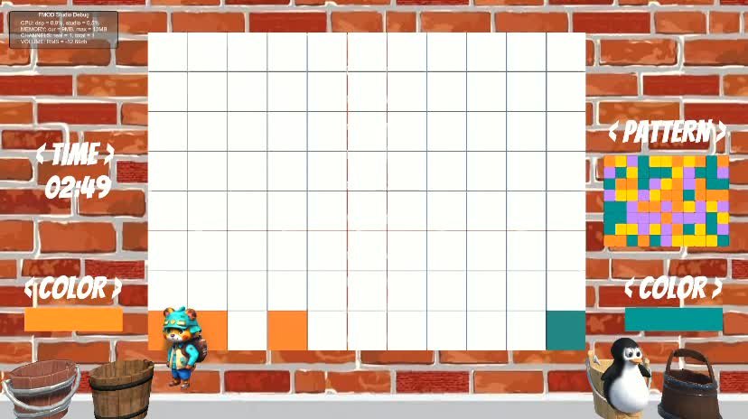
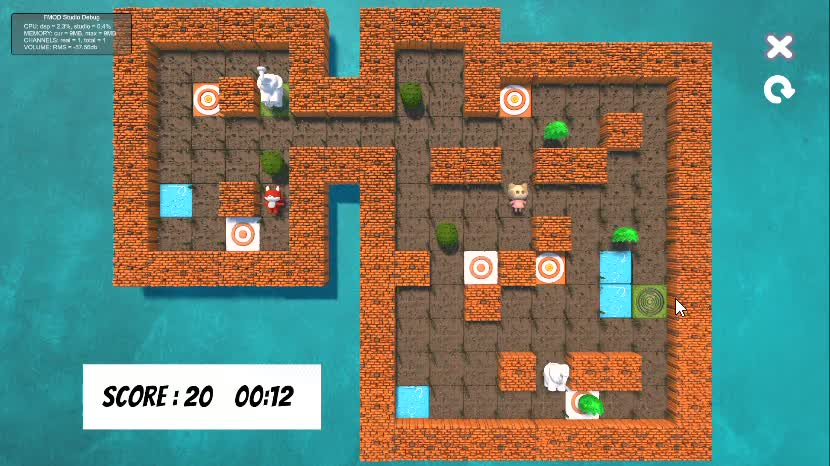

  

<h1 align="center">Village Retreat</h1>

<em>A relaxing cooperative game — the essence of tranquility.</em>

---

## About the Game

Two friends arrive in a new village with nothing. To build a house, they must gather materials by exploring the village and speaking with the locals. Each villager has a unique job related to a specific building material. There are four mini-games: one to collect wood, one to generate electricity, one to obtain ink for painting, and another to gather items for the garden. After completing all the mini-games, the friends finally get their house.

  

- Serene environments, perfect escape
- Players arrive at the village and must collect materials to build their house

---

## Game Interface

### Initial Menu
The first screen presented to the player, with two options:
- **Start** — begin the game
- **Quit** — exit the game

### Island (Main World)
A 3D open-world island where characters can walk and jump to explore the environment. Materials appear in a HUD at the bottom of the screen. Players interact with villagers to receive guidance and access mini-games, and can return to the main menu at any time.

   
  3D open world · interact with villagers to play games · play minigames to get materials

### User-Friendly Tutorials
Each mini-game opens with a short tutorial explaining the rules and controls, so players don't need to memorize anything beforehand. A skip button is available for players who prefer to jump straight in.

   
  Tutorial prompt from Timber Time

### Minigame End Screen
Every mini-game shares a consistent end-screen pattern: a result text, sometimes a score, and a button to return to the Island. If the player doesn't interact, they're returned automatically after a set time (shown at the bottom left).

### Final Cutscene
Once all materials are collected, a short non-interactive cutscene shows the house being built — a satisfying reward moment.

  

### Final Menu
After the cutscene, the player can:
- **Restart** — reset all progress and collected materials
- **Quit** — exit the game

---

## Mini-Games

### ⚡ Electrical Connections
A 2.5D cooperative logic puzzle. Each player controls a tile selector on their half of the board and rotates tiles 90° to route energy from generators to the house. Powered tiles turn yellow; unpowered ones stay black. A countdown timer (with a warning sound in the final 10 seconds) adds pressure. To win, all tiles must be connected with no open ends, including the house.

  

**Design notes:** Multiple generators are scattered around to add confusion, since not all need to be connected. Rotating tiles and first-time generator connections trigger audio feedback. The brick-and-vegetation wall suggests a circuit long disconnected, being reclaimed by nature. Built in 2.5D to increase immersion.

**Controls**
- Player 1: `WASD` to move the tile selector, `E` to rotate clockwise
- Player 2: Arrow keys to move the tile selector, `Enter` to rotate clockwise

---

### 🪓 Timber Time
A 2D minigame where both players race a 60-second clock, cutting logs at marked spots to reach a minimum of 400 points. Each player controls an axe restricted to their own side of the log. A correct cut scores 50 points; a wrong one costs 10 points. Completed or failed logs fall away and a new one appears.

  

**Design notes:** This minigame was originally a completely different concept — it was scrapped and rebuilt due to a lack of suitable assets. The final version was deliberately kept 2D (rather than 2.5D) to make sourcing matching assets easier.

**Controls**
- Player 1: `A`/`D` to move, `E` to cut
- Player 2: Left/right arrows to move, `Enter` to cut

---

### 🎨 Painting Walls
A 2.5D cooperative minigame where players match a color pattern on a wall within 2:30. Each player can access two color buckets, moves independently, and paints tiles that immediately reflect the correct color. The wall's worn-out look reinforces the theme of restoration.

  

**Design notes:** The tight time limit and shared pattern reference encourage communication so players don't waste moves on tiles the other has already covered.

**Controls**
- Player 1: `WASD` to move, `F` to paint/pick colors
- Player 2: Arrow keys to move, `Enter` to paint/pick colors

---

### 🌱 Zen Garden
A 2.5D sokoban-style cooperative puzzle. Players push color-coded pots onto matching targets — white pots to green targets, light green pots to white targets, dark green pots to orange targets. There is only one correct solution sequence, and placing two white pots simultaneously grants bonus points. Retry/forfeit options keep the experience stress-free.

  

**Design notes:** Considered the most complex minigame in the collection, balanced with a soft palette, relaxing music, and gentle sound cues to keep the puzzle difficulty from feeling stressful.

**Controls**
- Player 1: `WASD` to move
- Player 2: Arrow keys to move

---

## Sound Design

**Concept:** build a soothing, immersive soundscape matching the game's relaxing tone — combining environmental ambience, expressive character sounds, calm background music, and UI feedback.

**Workflow**
1. Sound categorization and asset management
2. Sound selection and matching to gameplay
3. Layering and detail in ambience
4. Custom variations for immersion

All audio was implemented and mixed in **FMOD**, integrated during the final production phase for ambient sound, character SFX, and UI feedback.

---

## Game World & Level Design

The game maintains a calm, relaxing tone throughout: ambient bird sounds and soft background music on the island, and peaceful music tailored to each mini-game — even during challenges. Players explore the 3D island, speak with villagers to unlock mini-games, and track collected materials via a HUD.

Each mini-game was designed to feel distinct, with world design adapted to its specific objective — from the reclaimed-by-nature brick wall of Electrical Connections to the soft, top-down palette of Zen Garden.

---

## Concept Art

- Some 3D models and assets were sourced from **Sketchfab**.
- Others were generated via an AI pipeline: **ChatGPT** for consistent character description prompts → **Meshy** to generate the 3D models from those prompts → **Mixamo** to rig and animate them.
- A handful of models (e.g., generator logos, the house in Electrical Connections) were built manually in Unity using the **ProBuilder** package.

---

## Engine & Tools

Built in **Unity**, chosen mainly for its flexible input system (ideal for configuring and testing cooperative keyboard/joystick control schemes) and its ease of use as the best free engine for the project's scope.

---

## Project Plan

| Phase | Weeks | Focus |
|---|---|---|
| Initial Setup & Planning | 1–3 | Game Concept Document, role assignment, main island prototype (movement, interaction triggers, camera), repo/version control setup, early FMOD planning, basic UI (menus, scene navigation) |
| Early Development & Asset Prep | 4–6 | Core systems for Electrical Connections, ZenGarden, and Timber Time (with placeholder visuals); grid logic, tile rotation, push mechanics, pot validation; AI-assisted and Sketchfab asset sourcing; early HUD and resource tracking |
| Core Implementation & Testing | 7–9 | Timber Time rebuilt from scratch; Painting Walls color-matching and brush interaction; structured internal playtesting; tutorials, end screens, sound/UI feedback |
| Polishing & Finalization | 10–11 | Final art, animation, and sound for all minigames; house-building cutscene; bug fixes; full FMOD integration; final builds and presentation prep |

**Testing** was split into two phases:
- **Internal Testing** — each team member tested parts built by others, verifying integration and functionality.
- **External Testing** — outside playtesters provided feedback that shaped numerous improvements to gameplay, interface, and overall UX.

---

## Controls Reference

| Context | Player 1 | Player 2 |
|---|---|---|
| Menus | Mouse to click | Mouse to click |
| Main Island | `A`/`D` rotate camera, `W`/`S` move, `Alt` interact, `Z` jump | Left/right arrows rotate camera, up/down move, `Enter` interact, `Space` jump |
| Timber Time | `A`/`D` move, `E` cut | Left/right arrows move, `Enter` cut |
| Electrical Connections | `WASD` move selector, `E` rotate | Arrow keys move selector, `Enter` rotate |
| Zen Garden | `WASD` move | Arrow keys move |
| Painting Walls | `WASD` move, `F` paint/pick | Arrow keys move, `Enter` paint/pick |

---

## Team F

**Developers**
- João Alves — 202108670
- Eduardo Sousa — 202103342
- Ema Martins — 202402794
- Igor Andrade — 202108674

**Sound Team**
- Linda Rodrigues — 202005545
- Ângela Costa — 202401679
