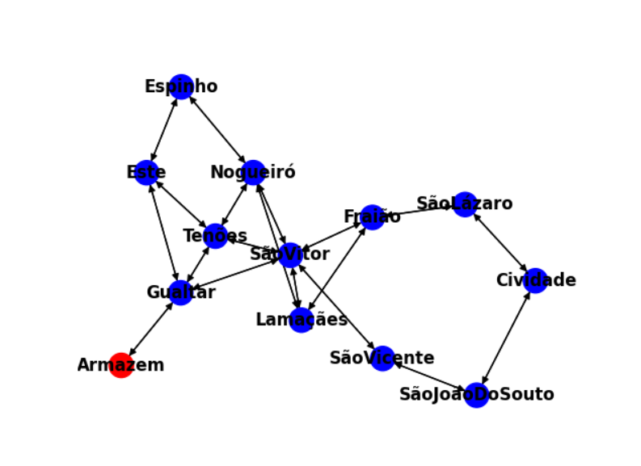

# Health Planet

This project aims to implement a delivery company called **Health Planet**, which focuses on delivering orders as sustainably as possible. The company employs couriers who deliver packages using **bicycles, motorcycles, or cars**, each with their own **ranking**.

### Key Features

- **Customer Ratings**: Customers can rate deliveries from 0 to 5.
- **Penalty System**: If a courier misses the delivery deadline set by the customer, their ranking is penalized.
- **Delivery Properties**: Each delivery is characterized by at least its **weight** and **volume**.
- **Pricing**: The delivery price depends on:
  - The package characteristics
  - The delivery deadline
  - The transport method

### Transport Details

- **Bicycles**:
  - Max load: 5 kg
  - Average speed: 10 km/h
  - Speed reduction: 0.6 km/h per kg

- **Motorcycles**:
  - Max load: 20 kg
  - Average speed: 35 km/h
  - Speed reduction: 0.5 km/h per kg

- **Cars**:
  - Max load: 100 kg
  - Average speed: 50 km/h
  - Speed reduction: 0.1 km/h per kg

### Additional Requirement

The program must be capable of generating **delivery routes** that cover a specific territory composed of **streets or neighborhoods**.

# How to run

Inside the project directory, run:

~~~bash
python3 main.py
~~~

# Members 

- Bruno Silva - A100828 
- Ema Martins - A97678 
- Henrique Malheiro – A97455 
- Manuel Serrano - A100825 
- Marta Gonçalves - A100593 
