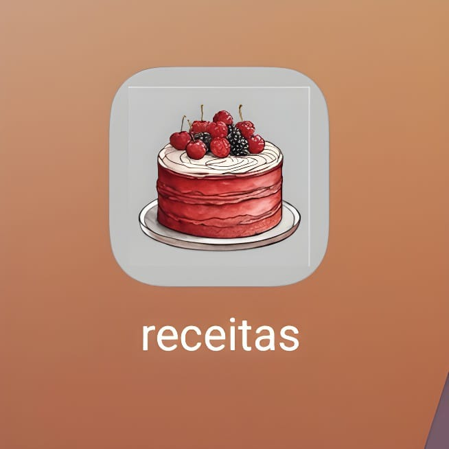
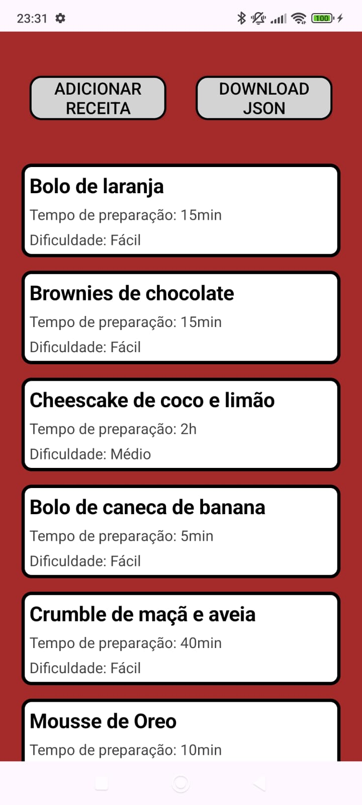
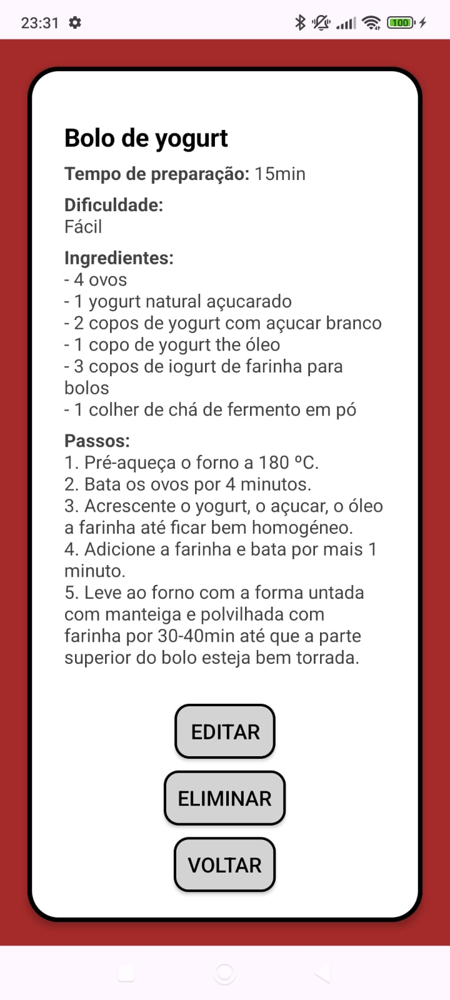
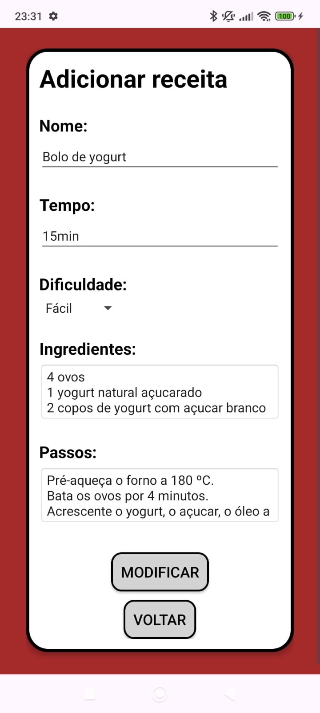
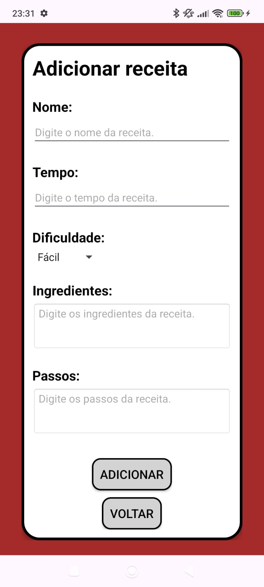

# Receitas

  

Receitas in a mobile app built in **Kotlin** to keep everything organized. I'm always experimenting with new recipes, and writing them down on paper often makes it hard to keep track.

That’s why I built this application. It allows me to add, update, delete, and view my recipes in a much more efficient way.

I can also download a **JSON** file with all my recipes in case I want to import them into another application.

|  |  |  |  |
|---------------|---------------|---------------|---------------|

