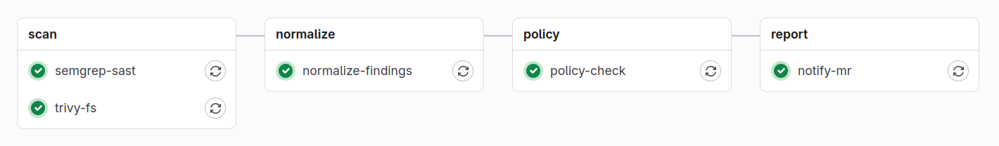

# CI/CD Security Gatekeeper

The main focus of this work is to create a GitLab pipeline that enforces secure coding practices by automatically running security analysis tools on every Merge Request.

To address this problem, we created the following pipeline.

## Stage 1 – Scan

The first stage has as its main function the **detection of vulnerabilities**. In this stage, two tools are executed:

- **Semgrep**: A SAST (Static Application Security Testing) tool that **analyzes source code** for vulnerability patterns using predefined security rule packages. We used several packages that include well-known patterns such as *all*, *python.lang.security.injection*, and *python.lang.security.crypto*. We also implemented some custom rules, which are defined in the *.semgrep.yaml* file. We avoided defining too many custom rules, since the main objective was to create a tool that is as generic as possible.

- **Trivy**: An SCA (Software Composition Analysis) tool that scans for known vulnerabilities **in project dependencies** and identifies security **misconfigurations**.

## Stage 2 – Normalize

After running the tools, two different reports are generated, each with a different format.

The main goal of this stage is to collect findings from Semgrep and Trivy, normalize them into a **single report (JSON format)**, and prepare them for subsequent triage and analysis.

## Stage 3 – Policy Check

In this stage, **Open Policy Agent (OPA)** acts as a security gate, **blocking** code changes that contain Error, Critical, or High severity vulnerabilities.

**Waivers** are used to manage exceptions by **suppressing** or **downgrading/upgrading** specific findings. In the final version of the project, waivers were applied only to suppress or upgrade severities, as these were the cases we considered to make the most sense.

## Stage 4 – Report

To help users understand the vulnerabilities present in the code and why the pipeline failed, security scan results are automatically posted as a note on the Merge Request.

The note includes the **number of detected vulnerabilities** that prevent the pipeline from passing, as well as a summary table containing **Severity, Tool, ID, and Description**. If the pipeline passes, a message is also shown indicating that no vulnerabilities were detected.

# Vulnerability Study

After concluding the pipeline, we built some case scenarios to test and evaluate the performance of our pipeline. The tables with the complete vulnerability analysis are in the annex section.

### Case 1 - Insecure Static Analysis Configuration

After all the evaluation, we obtained:
    
- **True Positives (TP)**: 15 (6 from Semgrep + 9 from Trivy)
- **False Positives (FP)**: 0 (The code actually contains the vulnerabilities flagged by the tools in this version)
- **False Negatives (FN)**: 5 (Critical logic, logging, and auth flaws missed)

This result means that we obtained for this case:

- **Precision**: 100%
- **Recall**: 75%

We can conclude that in this scenario, the tools were highly precise because the code contained exactly the bad practices they search for (Debug=True, Hardcoded Keys, Insecure CORS). However, they still missed the logic errors (Mock DB crash) and the specific way credentials were leaked in logs and the dictionary.

### Case 2 - Hardcoded Credentials Exposure

After all the evaluation, we obtained:
    
- **True Positives (TP)**: 11 (2 form Semgrep + 9 from Trivy)
- **False Positives (FP)**: 0 (The tools did not flag the commented-out code or debug settings in this run)
- **False Negatives (FN)**: 4 (Critical logic and security flaws missed)

This result means that we obtained for this case:

- **Precision**: 100%
- **Recall**: 73.3%

We can conclude that while the tools produced zero false alarms (high precision), they still missed significant logic and architectural flaws (authentication and logging), maintaining a recall of roughly 73%.

### Case 3 - Insecure Data Transmission

After all the evaluation, we obtained:
    
- **True Positives (TP)**: 17 (8 from Semgrep + 9 from Trivy)
- **False Positives (FP)**: 0 (All alerts provided in this report correspond to actual code issues)
- **False Negatives (FN)**: 3 (The logic crash from Case 2 was fixed, but Auth/Logging issues remain)

This result means that we obtained for this case:

- **Precision**: 100%
- **Recall**: 85%

We can conclude that the introduction of the requests library with insecure parameters (verify=False) was correctly identified by Semgrep, significantly increasing the True Positive count. The tools performed very well in this iteration, although architectural flaws (Authentication, Logging) still require manual review.

### Case 4 - Command Injection Vulnerability

After all the evaluation, we obtained:
    
- **True Positives (TP)**: 17 (8 from Semgrep + 9 from Trivy)
- **False Positives (FP)**: 0 (The code explicitly contains the command injection and debug flaws)
- **False Negatives (FN)**: 4 (Logic crash, Logging, Auth, Hardcoded Creds)

This result means that we obtained for this case:

- **Precision**: 100%
- **Recall**: 81%

We can conclude that the tools successfully identified the high-severity **Command Injection** vulnerability (subprocess with shell=True) and the insecure configuration (CORS and Debug), achieving high precision. However, the recurring architectural issues (Logging and Logic) remain undetected by static analysis.

### Case 5 - Use of Weak Cryptographic Hash (MD5)

After all the evaluation, we obtained:
    
- **True Positives (TP)**: 14 (5 from Semgrep + 9 from Trivy)
- **False Positives (FP)**: 0 (The tools correctly identified the code presence and risks)
- **False Negatives (FN)**: 5 (Weak Crypto Specifics, Logic crash, Logging, Auth, Hardcoded Creds)

This result means that we obtained for this case:

- **Precision**: 100%
- **Recall**: 74%

We can conclude that the tools were excellent at detecting the new critical vulnerability (**Pickle Deserialization**) and the library CVEs. They correctly stopped flagging CORS and Debug (since they were fixed). However, they missed the context of **Weak Cryptography** (MD5) and the persistent logical/architectural flaws.

## Overall Results Summary

After evaluating the pipeline across five distinct scenarios, ranging from basic configuration errors to complex critical vulnerabilities like Command Injection and Insecure Deserialization, we aggregated the performance metrics to determine the overall effectiveness of the toolset (Semgrep + Trivy).

The following table summarizes the detection metrics for each case:

| Case Scenario | True Positives (TP) | False Positives (FP) | False Negatives (FN) | Precision | Recall |
| :--- | :---: | :---: | :---: | :---: | :---: |
| **Case 1** (Re-eval) | 15 | 0 | 5 | 100% | 75.0% |
| **Case 2** | 11 | 0 | 4 | 100% | 73.3% |
| **Case 3** | 17 | 0 | 3 | 100% | 85.0% |
| **Case 4** | 17 | 0 | 4 | 100% | 81.0% |
| **Case 5** | 14 | 0 | 5 | 100% | 74.0% |
| **TOTAL / AVG** | **74** (Total) | **0** (Total) | **21** (Total) | **100%** | **77.7%** |

Based on the calculated averages, the pipeline demonstrated the following characteristics:

- **Average Precision = 100%**: The pipeline demonstrated perfect precision. Every alert generated by Semgrep and Trivy pointed to a legitimate security issue or a deviation from best practices present in the code. There were **zero False Positives** in this dataset. This indicates that the rulesets used are high-fidelity and unlikely to cause "alert fatigue" for the development team.

- **Average Recall = 77.7%**: The pipeline successfully identified roughly 3 out of every 4 vulnerabilities. The tools were extremely effective at detecting:
    - **Injection Flaws:** Command Injection (subprocess), Deserialization (pickle).
    - **Configuration Issues:** Debug modes, CORS settings, SSL verification.
    - **Dependencies:** Known CVEs in libraries (Werkzeug, Jinja2, Requests).

    The 22.3% of missed vulnerabilities (False Negatives) were consistently related to:

    - **Business Logic:** Application crashes due to improper variable types (Mock DB vs Real DB).
    - **Contextual Data Leaks:** Logging sensitive data (passwords) to stdout.
    - **Architectural Flaws:** Missing authentication/authorization checks on endpoints.
    - **Complex Data Structures:** Hardcoded secrets buried inside nested dictionaries were sometimes missed by pattern matchers.

### Blocked vs allowed MRs

To better understand how strictly our pipeline was being applied, we measured the number of blocked MRs, allowed MRs, and waived MRs. In our approach, waived MRs represent the number of times waivers were applied to MRs.

| Status      | Count |
|-------------|-------|
| Blocked MRs | 3     |
| Allowed MRs | 2     |
| Waived MRs  | 5     |

The data demonstrates that the pipeline's integrity is overly **dependent on the application of waivers**. In practice, compliance is only achieved through the **manual suppression of vulnerabilities**, suggesting that current security criteria may be misaligned with development realities.

# Conclusions

The implementation of **Semgrep** and **Trivy** provides a robust first line of defense, offering **100% precision** in this study. This ensures that developers can trust the alerts they receive. However, the **77.7% recall** highlights that Static Application Security Testing (SAST) and wait-for-fix scanning cannot completely replace manual code review or Dynamic Analysis (DAST), particularly for detecting logic flaws and architectural gaps (such as missing authentication) that automated tools struggle to interpret contextually.

Regarding the metrics for blocked versus allowed MRs, they do not fully reflect the pipeline's effectiveness because the test scenarios consistently included the same recurring vulnerability. To better demonstrate the system's robustness, **future benchmarks should include scenarios without this specific issue**, proving that the pipeline allows MRs to **pass naturally when all criteria are met**.

# Annex

The annex presents a detailed analysis of the vulnerabilities in our cases.

### Case 1 - Insecure Static Analysis Configuration

The analysis of the vulnerabilities provided by Semgrep and Trivy is listed in the following table.

| Tool | File | Line | Alert / CVE | Analysis and Context | Classification |
| :--- | :--- | :--- | :--- | :--- | :--- |
| **semgrep** | demo/api.py | 8 | insecure-cors | The code explicitly enables CORS for all origins: CORS(app, origins="*"). This allows any domain to access the API. | **True Positive (TP)** |
| **semgrep** | demo/api.py | 27 | hardcoded-config_SECRET_KEY | The code sets a hardcoded secret: app.config["SECRET_KEY"] = "...". This is unsafe for production. | **True Positive (TP)** |
| **semgrep** | demo/api.py | 129 | gitlab.bandit.B201 | The application is running with debug=True. This exposes stack traces and interactive debuggers to attackers. | **True Positive (TP)** |
| **semgrep** | demo/api.py | 129 | debug-enabled | Redundant alert for debug=True. Confirmed as a valid risk. | **True Positive (TP)** |
| **semgrep** | demo/populate.py | 24 | unspecified-open-encoding | Missing encoding='utf-8' in open(). | **True Positive (TP)** |
| **semgrep** | demo/populate.py | 28 | unspecified-open-encoding | Missing encoding='utf-8' in open(). | **True Positive (TP)** |
| **trivy** | demo/requirements.txt | - | **CVE-2024-49766** | **Werkzeug:** Path traversal issue on Windows via safe_join. Fixed in 3.0.6. | **True Positive (TP)** |
| **trivy** | demo/requirements.txt | - | **CVE-2024-49767** | **Werkzeug:** DoS vulnerability via resource exhaustion in multipart parsing. Fixed in 3.0.6. | **True Positive (TP)** |
| **trivy** | demo/requirements.txt | - | **CVE-2025-66221** | **Werkzeug:** Infinite hang when reading special Windows device names. Fixed in 3.1.4. | **True Positive (TP)** |
| **trivy** | demo/requirements.txt | - | **CVE-2024-34064** | **Jinja2:** XSS vulnerability via xmlattr filter accepting non-attribute keys. Fixed in 3.1.4. | **True Positive (TP)** |
| **trivy** | demo/requirements.txt | - | **CVE-2024-56201** | **Jinja2:** Code execution via compilation bug involving template filenames. Fixed in 3.1.5. | **True Positive (TP)** |
| **trivy** | demo/requirements.txt | - | **CVE-2024-56326** | **Jinja2:** Sandbox escape via str.format. Fixed in 3.1.5. | **True Positive (TP)** |
| **trivy** | demo/requirements.txt | - | **CVE-2025-27516** | **Jinja2:** Sandbox escape via |attr filter. Fixed in 3.1.6. | **True Positive (TP)** |
| **trivy** | demo/requirements.txt | - | **CVE-2024-5629** | **PyMongo:** Out-of-bounds read in bson module. Affects <= 4.6.2. | **True Positive (TP)** |
| **trivy** | demo/requirements.txt | - | **CVE-2024-47081** | **Requests:** Leaks .netrc credentials to third parties. Fixed in 2.32.4. | **True Positive (TP)** |

There were some vulnerabilities that weren't found by the tools automatically, meaning they are False Negatives.

| Tool | File | Line / Scope | Alert / Issue | Analysis and Context |
| :--- | :--- | :--- | :--- | :--- |
| **Manual Review** | demo/api.py | create_user | **Sensitive Data Exposure in Logs** | The code explicitly prints the user object: print("New user:", new_user). This leaks the plain-text password into server logs. |
| **Manual Review** | demo/api.py | create_user | **Plaintext Password Storage** | Passwords are stored directly in the database without hashing. |
| **Manual Review** | demo/api.py | All Endpoints | **Missing Authentication** | Endpoints are accessible without any token validation. Anyone can delete users or view events. |
| **Manual Review** | demo/api.py | Global Dict | **Hardcoded Credentials** | The client dictionary contains: "password": "admin". Semgrep failed to detect this hardcoded secret inside the dictionary. |
| **Manual Review** | demo/api.py | Database Logic | **Broken Logic / DoS Risk** | The code defines client as a Python dictionary but tries to use MongoDB methods (.find()). This will cause the application to crash immediately upon request (Denial of Service). |

### Case 2 - Hardcoded Credentials Exposure

The analysis of the vulnerabilities provided by Semgrep and Trivy is listed in the following table.

| Tool | File | Line | Alert / CVE | Analysis and Context | Classification |
| :--- | :--- | :--- | :--- | :--- | :--- |
| **semgrep** | demo/populate.py | 24 | unspecified-open-encoding | Missing encoding='utf-8' in open(). This relies on system locale and can corrupt data. | **True Positive (TP)** |
| **semgrep** | demo/populate.py | 28 | unspecified-open-encoding | Missing encoding='utf-8' in open(). This relies on system locale and can corrupt data. | **True Positive (TP)** |
| **trivy** | demo/requirements.txt | - | **CVE-2024-49766** | **Werkzeug:** Path traversal issue on Windows via safe_join. Fixed in 3.0.6. | **True Positive (TP)** |
| **trivy** | demo/requirements.txt | - | **CVE-2024-49767** | **Werkzeug:** DoS vulnerability via resource exhaustion in multipart parsing. Fixed in 3.0.6. | **True Positive (TP)** |
| **trivy** | demo/requirements.txt | - | **CVE-2025-66221** | **Werkzeug:** Infinite hang when reading special Windows device names. Fixed in 3.1.4. | **True Positive (TP)** |
| **trivy** | demo/requirements.txt | - | **CVE-2024-34064** | **Jinja2:** XSS vulnerability via xmlattr filter accepting non-attribute keys. Fixed in 3.1.4. | **True Positive (TP)** |
| **trivy** | demo/requirements.txt | - | **CVE-2024-56201** | **Jinja2:** Code execution via compilation bug involving template filenames. Fixed in 3.1.5. | **True Positive (TP)** |
| **trivy** | demo/requirements.txt | - | **CVE-2024-56326** | **Jinja2:** Sandbox escape via str.format. Fixed in 3.1.5. | **True Positive (TP)** |
| **trivy** | demo/requirements.txt | - | **CVE-2025-27516** | **Jinja2:** Sandbox escape via attr filter. Fixed in 3.1.6. | **True Positive (TP)** |
| **trivy** | demo/requirements.txt | - | **CVE-2024-5629** | **PyMongo:** Out-of-bounds read in bson module. Affects <= 4.6.2. | **True Positive (TP)** |
| **trivy** | demo/requirements.txt | - | **CVE-2024-47081** | **Requests:** Leaks .netrc credentials to third parties. Fixed in 2.32.4. | **True Positive (TP)** |

There were some vulnerabilities that weren't found by the tools automatically, meaning they are False Negatives.

| Tool | File | Line / Scope | Alert / Issue | Analysis and Context |
| :--- | :--- | :--- | :--- | :--- |
| **Manual Review** | demo/api.py | create_user | **Sensitive Data Exposure in Logs** | The code explicitly prints the user object: print("Creating user:", new_user). This leaks the plain-text password into server logs. |
| **Manual Review** | demo/api.py | All Endpoints | **Missing Authentication** | Endpoints are accessible without any token validation. Anyone can delete users or view events. |
| **Manual Review** | demo/api.py | Global Dict | **Hardcoded Credentials** | The client dictionary contains: "password": "admin". Semgrep failed to detect this hardcoded secret. |
| **Manual Review** | demo/api.py | Database Logic | **Broken Logic / DoS Risk** | The code defines client as a Python dictionary but tries to use MongoDB methods (.find()). This will cause the application to crash immediately upon request (Denial of Service). |

### Case 3 - Insecure Data Transmission

The analysis of the vulnerabilities provided by Semgrep and Trivy is listed in the following table.

| Tool | File | Line | Alert / CVE | Analysis and Context | Classification |
| :--- | :--- | :--- | :--- | :--- | :--- |
| **semgrep** | demo/api.py | 11 | mongodb-insecure-transport | Detected unencrypted MongoDB connection (mongodb://). Prefer tls=true for production. | **True Positive (TP)** |
| **semgrep** | demo/api.py | 27 | gitlab.bandit.B113 | Missing timeout in requests.get. Can lead to DoS if the server hangs. | **True Positive (TP)** |
| **semgrep** | demo/api.py | 27 | gitlab.bandit.B501 | **Critical:** verify=False detected. Disables SSL certificate validation, allowing MitM attacks. | **True Positive (TP)** |
| **semgrep** | demo/api.py | 27 | use-raise-for-status | Missing raise_for_status(). Errors (e.g., 500 or 401) will go unnoticed. | **True Positive (TP)** |
| **semgrep** | demo/api.py | 27 | use-timeout | Duplicate warning regarding the missing timeout in requests. | **True Positive (TP)** |
| **semgrep** | demo/api.py | 27 | disabled-cert-validation | **Critical:** Explicitly confirms that certificate validation is disabled (verify=False). | **True Positive (TP)** |
| **semgrep** | demo/populate.py | 24 | unspecified-open-encoding | Missing encoding='utf-8' in open(). | **True Positive (TP)** |
| **semgrep** | demo/populate.py | 28 | unspecified-open-encoding | Missing encoding='utf-8' in open(). | **True Positive (TP)** |
| **trivy** | demo/requirements.txt | - | **CVE-2024-49766** | **Werkzeug:** Path traversal issue on Windows via safe_join. Fixed in 3.0.6. | **True Positive (TP)** |
| **trivy** | demo/requirements.txt | - | **CVE-2024-49767** | **Werkzeug:** DoS vulnerability via resource exhaustion in multipart parsing. Fixed in 3.0.6. | **True Positive (TP)** |
| **trivy** | demo/requirements.txt | - | **CVE-2025-66221** | **Werkzeug:** Infinite hang when reading special Windows device names. Fixed in 3.1.4. | **True Positive (TP)** |
| **trivy** | demo/requirements.txt | - | **CVE-2024-34064** | **Jinja2:** XSS vulnerability via xmlattr filter accepting non-attribute keys. Fixed in 3.1.4. | **True Positive (TP)** |
| **trivy** | demo/requirements.txt | - | **CVE-2024-56201** | **Jinja2:** Code execution via compilation bug involving template filenames. Fixed in 3.1.5. | **True Positive (TP)** |
| **trivy** | demo/requirements.txt | - | **CVE-2024-56326** | **Jinja2:** Sandbox escape via str.format. Fixed in 3.1.5. | **True Positive (TP)** |
| **trivy** | demo/requirements.txt | - | **CVE-2025-27516** | **Jinja2:** Sandbox escape via attr filter. Fixed in 3.1.6. | **True Positive (TP)** |
| **trivy** | demo/requirements.txt | - | **CVE-2024-5629** | **PyMongo:** Out-of-bounds read in bson module. Affects <= 4.6.2. | **True Positive (TP)** |
| **trivy** | demo/requirements.txt | - | **CVE-2024-47081** | **Requests:** Leaks .netrc credentials to third parties. Fixed in 2.32.4. | **True Positive (TP)** |

There were some vulnerabilities that weren't found by the tools automatically, meaning they are False Negatives.

| Tool | File | Line / Scope | Alert / Issue | Analysis and Context |
| :--- | :--- | :--- | :--- | :--- |
| **Manual Review** | demo/api.py | create_user | **Sensitive Data Exposure in Logs** | The code explicitly prints the user object: print("New user:", new_user). This leaks the plain-text password into server logs. |
| **Manual Review** | demo/api.py | create_user | **Plaintext Password Storage** | Passwords are stored directly in the database without hashing. |
| **Manual Review** | demo/api.py | All Endpoints | **Missing Authentication** | Endpoints are accessible without any token validation. Anyone can delete users or view events. |

### Case 4 - Command Injection Vulnerability

The analysis of the vulnerabilities provided by Semgrep and Trivy is listed in the following table.

| Tool | File | Line | Alert / CVE | Analysis and Context | Classification |
| :--- | :--- | :--- | :--- | :--- | :--- |
| **semgrep** | demo/api.py | 8 | insecure-cors | The code explicitly enables CORS(app, origins="*"). This allows any domain to access the API. | **True Positive (TP)** |
| **semgrep** | demo/api.py | 128 | gitlab.bandit.B602 | **Critical:** subprocess.run(..., shell=True) detected. This allows attackers to execute arbitrary OS commands. | **True Positive (TP)** |
| **semgrep** | demo/api.py | 128 | dangerous-subprocess-use-audit | **Critical:** The input to subprocess is not a static string (user_input), implying it comes from an external source (Injection risk). | **True Positive (TP)** |
| **semgrep** | demo/api.py | 128 | subprocess-shell-true | Redundant alert for shell=True. Confirms the high severity of the flaw. | **True Positive (TP)** |
| **semgrep** | demo/api.py | 131 | gitlab.bandit.B201 | The application is running with debug=True. This exposes stack traces and interactive debuggers to attackers. | **True Positive (TP)** |
| **semgrep** | demo/api.py | 131 | debug-enabled | Redundant alert for debug=True. Confirmed as a valid risk. | **True Positive (TP)** |
| **semgrep** | demo/populate.py | 24 | unspecified-open-encoding | Missing encoding='utf-8' in open(). | **True Positive (TP)** |
| **semgrep** | demo/populate.py | 28 | unspecified-open-encoding | Missing encoding='utf-8' in open(). | **True Positive (TP)** |
| **trivy** | demo/requirements.txt | - | **CVE-2024-49766** | **Werkzeug:** Path traversal issue on Windows via safe_join. Fixed in 3.0.6. | **True Positive (TP)** |
| **trivy** | demo/requirements.txt | - | **CVE-2024-49767** | **Werkzeug:** DoS vulnerability via resource exhaustion in multipart parsing. Fixed in 3.0.6. | **True Positive (TP)** |
| **trivy** | demo/requirements.txt | - | **CVE-2025-66221** | **Werkzeug:** Infinite hang when reading special Windows device names. Fixed in 3.1.4. | **True Positive (TP)** |
| **trivy** | demo/requirements.txt | - | **CVE-2024-34064** | **Jinja2:** XSS vulnerability via xmlattr filter accepting non-attribute keys. Fixed in 3.1.4. | **True Positive (TP)** |
| **trivy** | demo/requirements.txt | - | **CVE-2024-56201** | **Jinja2:** Code execution via compilation bug involving template filenames. Fixed in 3.1.5. | **True Positive (TP)** |
| **trivy** | demo/requirements.txt | - | **CVE-2024-56326** | **Jinja2:** Sandbox escape via str.format. Fixed in 3.1.5. | **True Positive (TP)** |
| **trivy** | demo/requirements.txt | - | **CVE-2025-27516** | **Jinja2:** Sandbox escape via attr filter. Fixed in 3.1.6. | **True Positive (TP)** |
| **trivy** | demo/requirements.txt | - | **CVE-2024-5629** | **PyMongo:** Out-of-bounds read in bson module. Affects <= 4.6.2. | **True Positive (TP)** |
| **trivy** | demo/requirements.txt | - | **CVE-2024-47081** | **Requests:** Leaks .netrc credentials to third parties. Fixed in 2.32.4. | **True Positive (TP)** |

There were some vulnerabilities that weren't found by the tools automatically, meaning they are False Negatives.

| Tool | File | Line / Scope | Alert / Issue | Analysis and Context |
| :--- | :--- | :--- | :--- | :--- |
| **Manual Review** | demo/api.py | create_user | **Sensitive Data Exposure in Logs** | The code explicitly prints the user object: print("New user:", new_user). This leaks the plain-text password into server logs. |
| **Manual Review** | demo/api.py | All Endpoints | **Missing Authentication** | Endpoints are accessible without any token validation. Anyone can delete users or view events. |
| **Manual Review** | demo/api.py | Global Dict | **Hardcoded Credentials** | The client dictionary contains: "password": "admin". Semgrep failed to detect this hardcoded secret inside the dictionary structure. |
| **Manual Review** | demo/api.py | Database Logic | **Broken Logic / DoS Risk** | The code defines client as a Python dictionary but tries to use MongoDB methods (.find()). This will cause the application to crash immediately (Denial of Service). |

The analysis of the vulnerabilities provided by Semgrep and Trivy is listed in the following table.

| Tool | File | Line | Alert / CVE | Analysis and Context | Classification |
| :--- | :--- | :--- | :--- | :--- | :--- |
| **semgrep** | demo/api.py | 129 | gitlab.bandit.B603 | **Subprocess without shell:** The code calls subprocess.check_output to run Python. While safer than shell=True, spawning a new process just to calculate an MD5 hash is extremely inefficient and poor practice, though not directly exploitable for injection here. | **True Positive (Bad Practice)** |
| **semgrep** | demo/api.py | 133 | gitlab.bandit.B301-1 | **Critical: Unsafe Deserialization.** The code uses pickle.loads(blob). This allows an attacker to pass a malicious serialized object that executes arbitrary code when decoded. | **True Positive (TP)** |
| **semgrep** | demo/api.py | 133 | avoid-pickle | Redundant alert for pickle. Confirms the high severity of the deserialization flaw. | **True Positive (TP)** |
| **semgrep** | demo/populate.py | 24 | unspecified-open-encoding | Missing encoding='utf-8' in open(). | **True Positive (TP)** |
| **semgrep** | demo/populate.py | 28 | unspecified-open-encoding | Missing encoding='utf-8' in open(). | **True Positive (TP)** |
| **trivy** | demo/requirements.txt | - | **CVE-2024-49766** | **Werkzeug:** Path traversal issue on Windows via safe_join. Fixed in 3.0.6. | **True Positive (TP)** |
| **trivy** | demo/requirements.txt | - | **CVE-2024-49767** | **Werkzeug:** DoS vulnerability via resource exhaustion in multipart parsing. Fixed in 3.0.6. | **True Positive (TP)** |
| **trivy** | demo/requirements.txt | - | **CVE-2025-66221** | **Werkzeug:** Infinite hang when reading special Windows device names. Fixed in 3.1.4. | **True Positive (TP)** |
| **trivy** | demo/requirements.txt | - | **CVE-2024-34064** | **Jinja2:** XSS vulnerability via xmlattr filter accepting non-attribute keys. Fixed in 3.1.4. | **True Positive (TP)** |
| **trivy** | demo/requirements.txt | - | **CVE-2024-56201** | **Jinja2:** Code execution via compilation bug involving template filenames. Fixed in 3.1.5. | **True Positive (TP)** |
| **trivy** | demo/requirements.txt | - | **CVE-2024-56326** | **Jinja2:** Sandbox escape via str.format. Fixed in 3.1.5. | **True Positive (TP)** |
| **trivy** | demo/requirements.txt | - | **CVE-2025-27516** | **Jinja2:** Sandbox escape via |attr filter. Fixed in 3.1.6. | **True Positive (TP)** |
| **trivy** | demo/requirements.txt | - | **CVE-2024-5629** | **PyMongo:** Out-of-bounds read in bson module. Affects <= 4.6.2. | **True Positive (TP)** |
| **trivy** | demo/requirements.txt | - | **CVE-2024-47081** | **Requests:** Leaks .netrc credentials to third parties. Fixed in 2.32.4. | **True Positive (TP)** |

There were some vulnerabilities that weren't found by the tools automatically, meaning they are False Negatives.

| Tool | File | Line / Scope | Alert / Issue | Analysis and Context |
| :--- | :--- | :--- | :--- | :--- |
| **Manual Review** | demo/api.py | weak_crypto | **Weak Cryptography (MD5)** | The code explicitly uses hashlib.md5. Semgrep flagged the *subprocess* used to call it, but missed the fact that MD5 itself is broken and should not be used for security. |
| **Manual Review** | demo/api.py | create_user | **Sensitive Data Exposure in Logs** | The code explicitly prints the user object: print("New user:", new_user). This leaks the plain-text password into server logs. |
| **Manual Review** | demo/api.py | All Endpoints | **Missing Authentication** | Endpoints are accessible without any token validation. Anyone can delete users or view events. |
| **Manual Review** | demo/api.py | Global Dict | **Hardcoded Credentials** | The client dictionary contains: "password": "admin". Semgrep failed to detect this hardcoded secret inside the dictionary structure. |
| **Manual Review** | demo/api.py | Database Logic | **Broken Logic / DoS Risk** | The code defines client as a Python dictionary but tries to use MongoDB methods (.find()). This will cause the application to crash immediately (Denial of Service). |