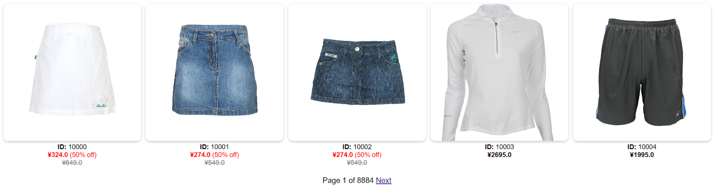
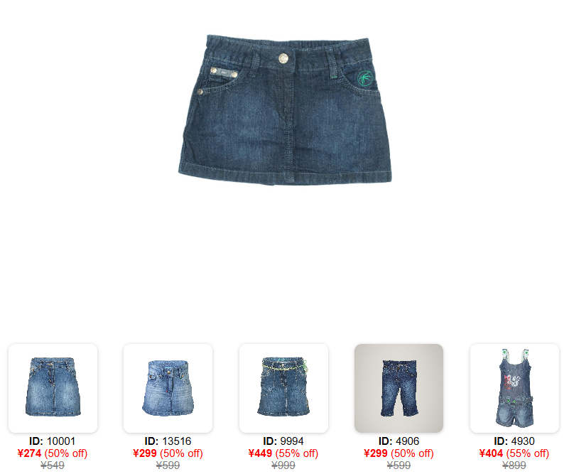

# Clothing Store Recommendation System

A transparent and customizable clothing recommendation system built using a modified **KD-Tree** structure and weighted Euclidean distance, developed as a final project for Data Structures and Advanced Algorithms (EDAA).

---

## Features

- **Transparent Recommendations:** Replaces black-box AI models with clear, rule-based feature weighting.
- **Custom KD-Tree Implementation:** Uses bounded tree depth, bucket leaf nodes, and controlled backtracking to handle high-dimensional one-hot encoded data.
- **Weighted Distance Matching:** Prioritizes key apparel attributes like category, sub-category, intended usage, color harmony, and discounts.
- **Web Interface:** Built with Python (Flask) for easy product browsing and real-time recommendation retrieval.

---

## How It Works

1. **Data Preprocessing:** Discretizes numerical features (e.g., price into ranges) and applies One-Hot Encoding to categorical attributes.
2. **KD-Tree Construction:** Builds a space-partitioning tree splitting on the most discriminative axes until reaching `max_depth = 15` or `min_bucket_size = 10`.
3. **KNN Search with Backtracking:** Finds similar items in the target bucket and explores up to `50` neighboring branches using a max heap.
4. **Weighted Distance Formula:**

$$d(x, y) = \sqrt{\sum_{i} w_i (x_i - y_i)^2}$$

### Feature Weights
- **SubCategory & Usage:** Weight = `2.0`
- **Exact Color Match:** Weight = `2.0`
- **Complementary Color Match:** Weight = `1.0`
- **Category Match:** Weight = `1.0`
- **On Sale Item:** Weight = `1.0` *(introduces discovery variance)*

---

## Parameters & Tuning

| Parameter | Value | Description |
| :--- | :---: | :--- |
| **Max Tree Depth** | `15` | Limits depth to avoid high-dimensional degradation. |
| **Bucket Size** | `10` | Minimum number of items stored in each leaf node. |
| **Max Backtracks** | `50` | Number of unexplored branches to visit during search. |

---

## Performance Comparison

In a user empirical study scoring recommendations from `0.0` (bad) to `1.0` (good), our system performed competitively against industry platforms:

| Platform | Avg Score |
| :--- | :---: |
| **Our System** | **0.550** |
| SHEIN | 0.500 |
| Primark | 0.558 |

---

## Web Application Interface

### Product Gallery

### Recommendations View

---

## Tech Stack

- **Backend:** Python, Flask
- **Data Structures & Processing:** KD-Tree, Max Heap (`heapq`), Pandas, Scikit-learn
- **Frontend:** HTML, CSS, JavaScript

---

## How to run

To run the app, you only need to run the app.py file.

~~~bash
python3 app.py
~~~

## Authors

- **Ema Martins** 
- **Tomás Ribeiro** 
